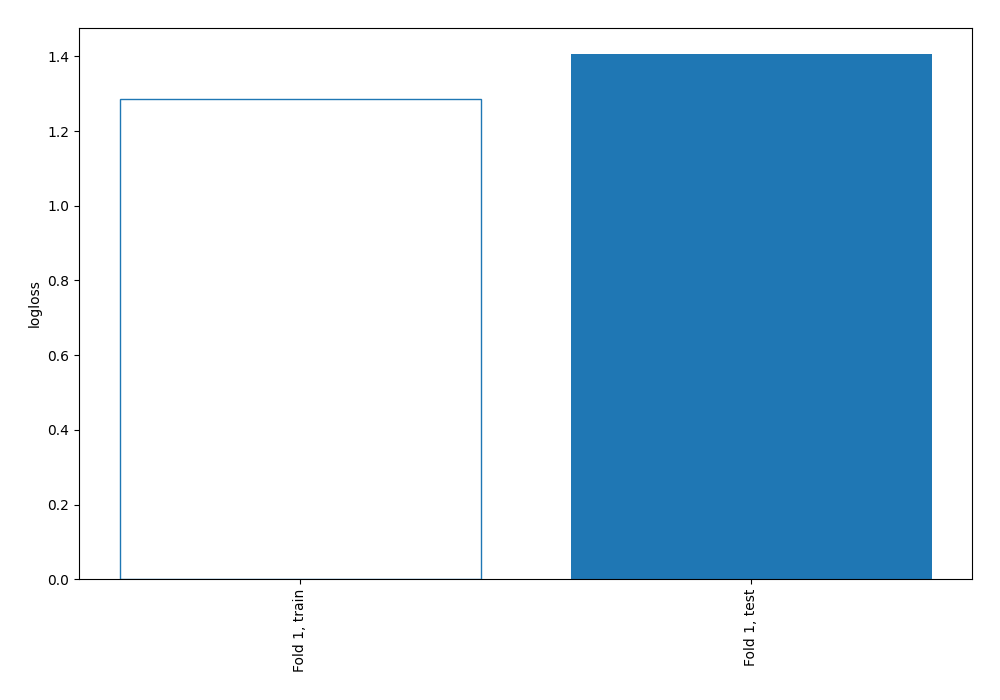
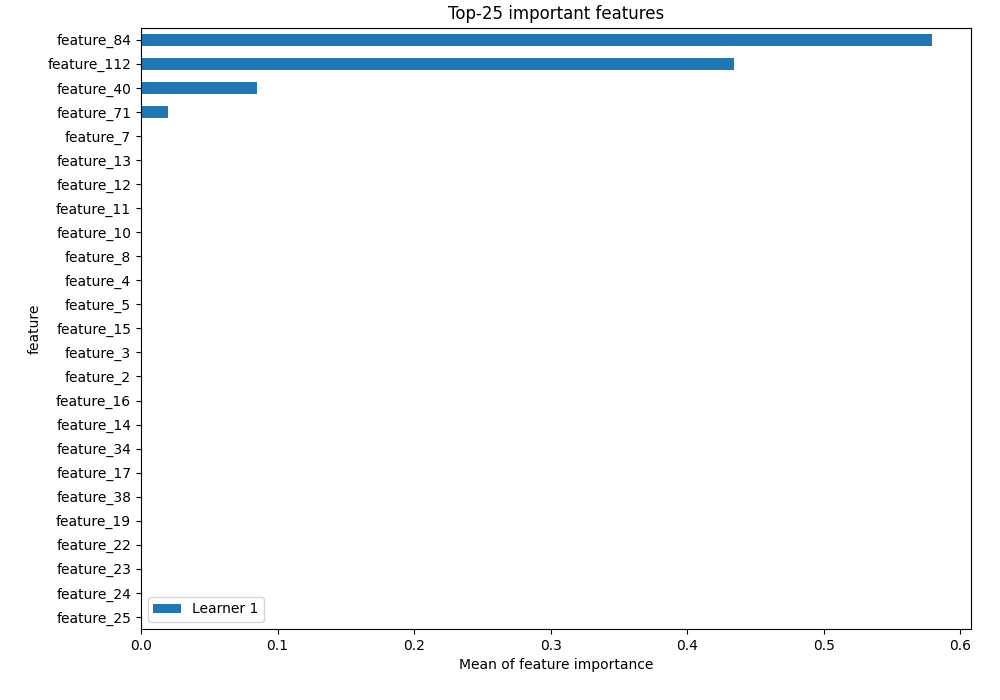
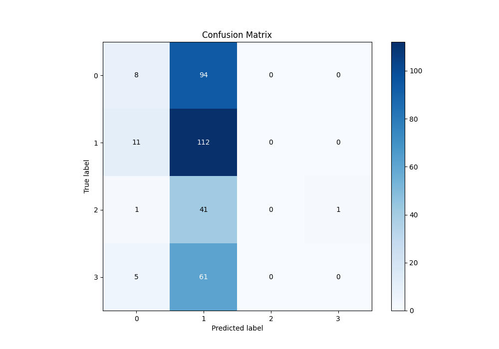
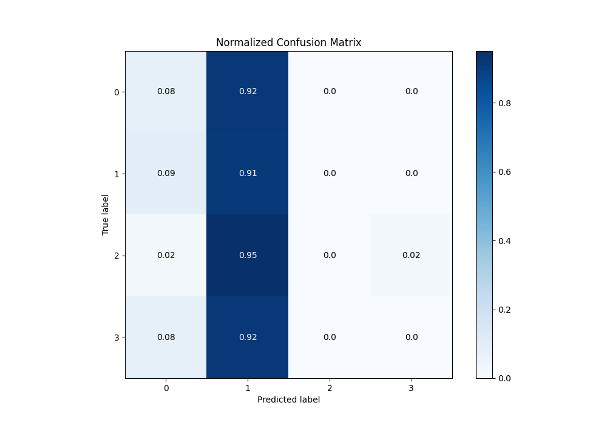
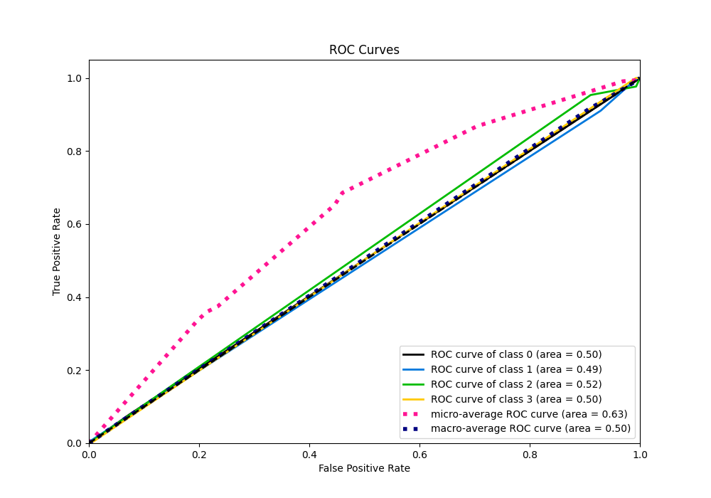
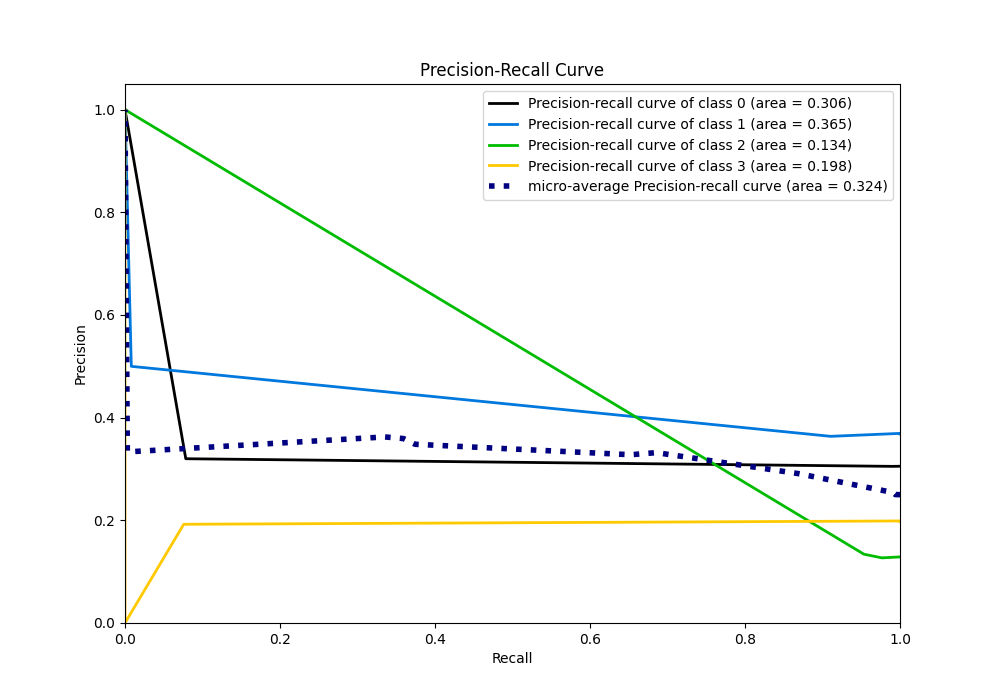

# Summary of 2_DecisionTree

[<< Go back](../README.md)

## Decision Tree
- **n_jobs**: -1
- **criterion**: gini
- **max_depth**: 3
- **num_class**: 4
- **explain_level**: 2

## Validation
 - **validation_type**: split
 - **train_ratio**: 0.75
 - **shuffle**: True
 - **stratify**: True

## Optimized metric
logloss

## Training time

20.9 seconds

### Metric details
|           |           0 |          1 |   2 |   3 |   accuracy |   macro avg |   weighted avg |   logloss |
|:----------|------------:|-----------:|----:|----:|-----------:|------------:|---------------:|----------:|
| precision |   0.32      |   0.363636 |   0 |   0 |   0.359281 |    0.170909 |       0.231639 |   1.40617 |
| recall    |   0.0784314 |   0.910569 |   0 |   0 |   0.359281 |    0.24725  |       0.359281 |   1.40617 |
| f1-score  |   0.125984  |   0.519722 |   0 |   0 |   0.359281 |    0.161426 |       0.229869 |   1.40617 |
| support   | 102         | 123        |  43 |  66 |   0.359281 |  334        |     334        |   1.40617 |

## Confusion matrix
|              |   Predicted as 0 |   Predicted as 1 |   Predicted as 2 |   Predicted as 3 |
|:-------------|-----------------:|-----------------:|-----------------:|-----------------:|
| Labeled as 0 |                8 |               94 |                0 |                0 |
| Labeled as 1 |               11 |              112 |                0 |                0 |
| Labeled as 2 |                1 |               41 |                0 |                1 |
| Labeled as 3 |                5 |               61 |                0 |                0 |

## Learning curves

## Permutation-based Importance

## Confusion Matrix

## Normalized Confusion Matrix

## ROC Curve

## Precision Recall Curve

[<< Go back](../README.md)
