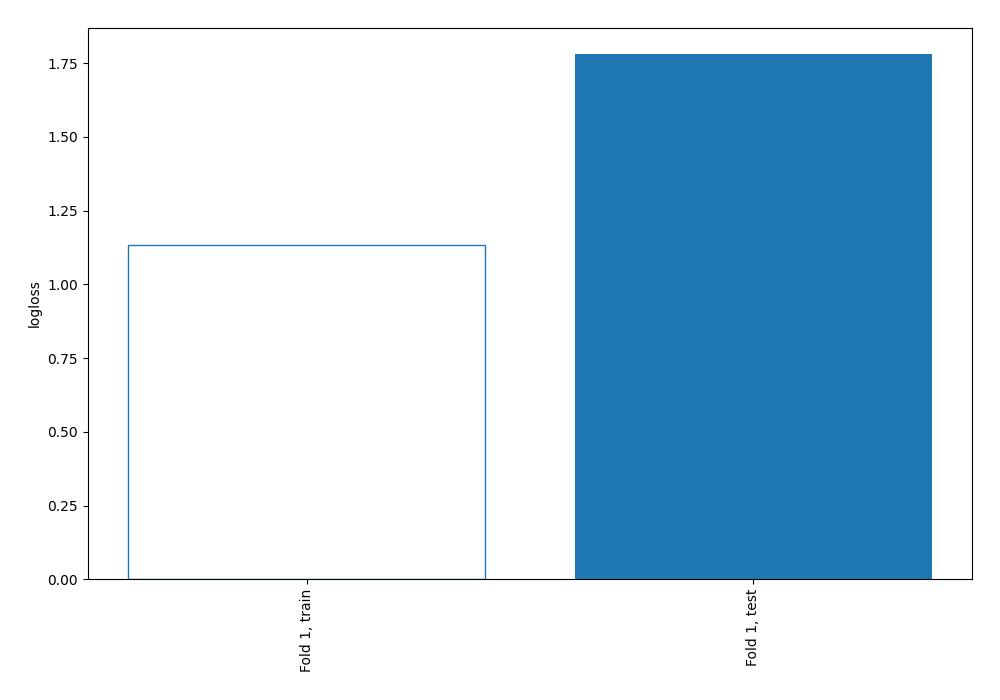
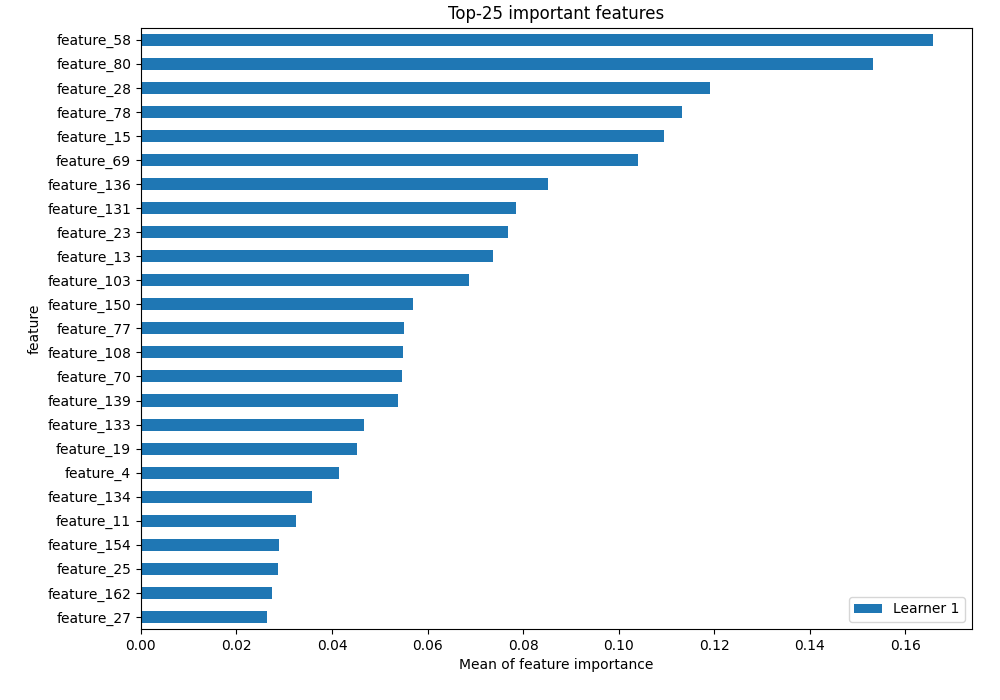
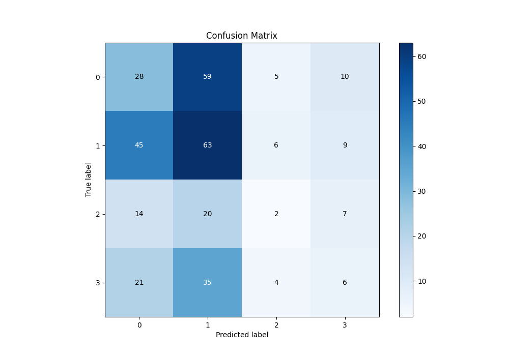
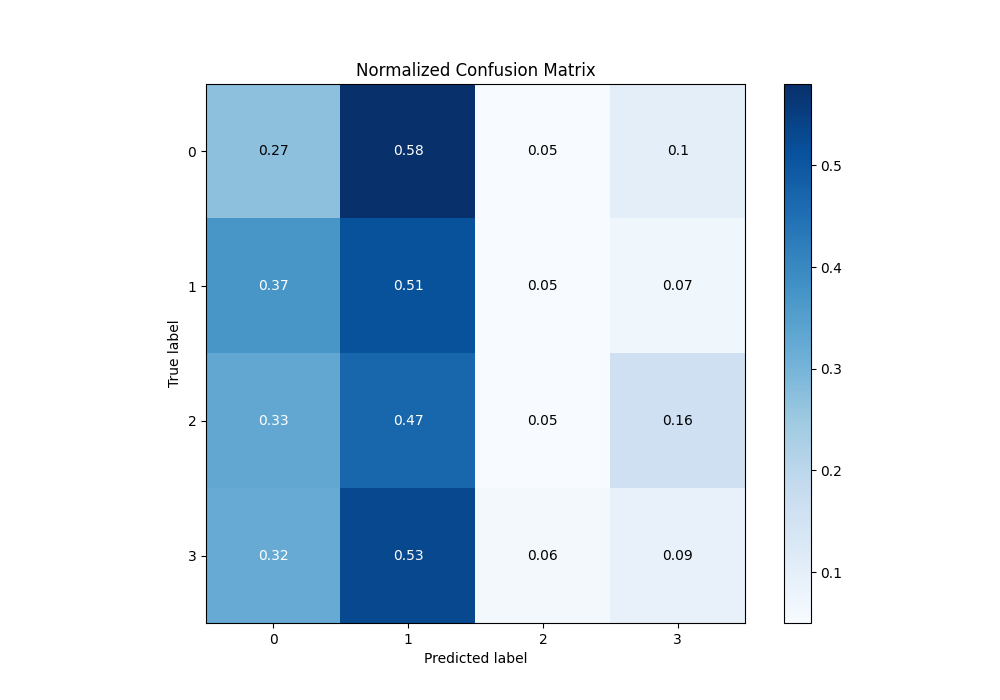
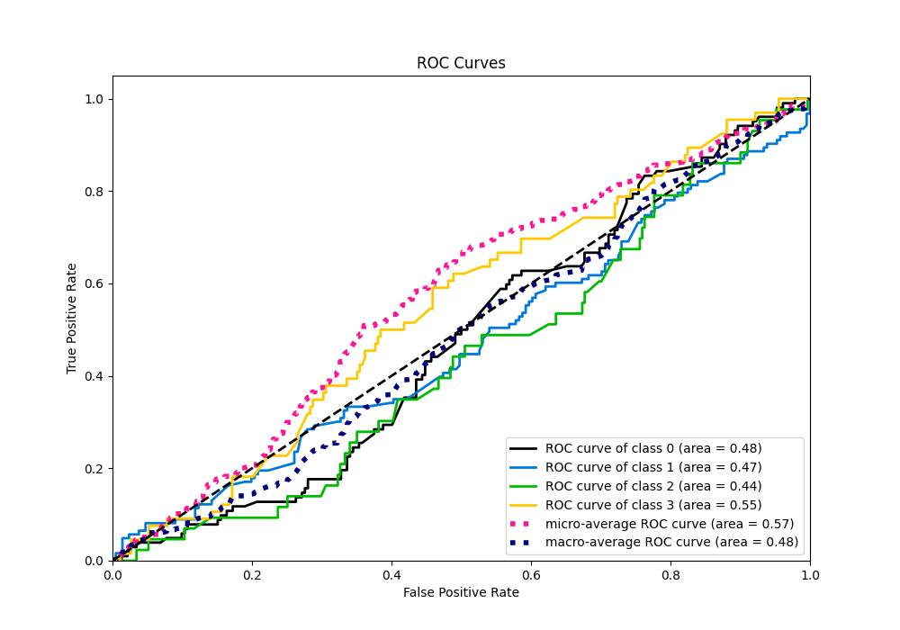
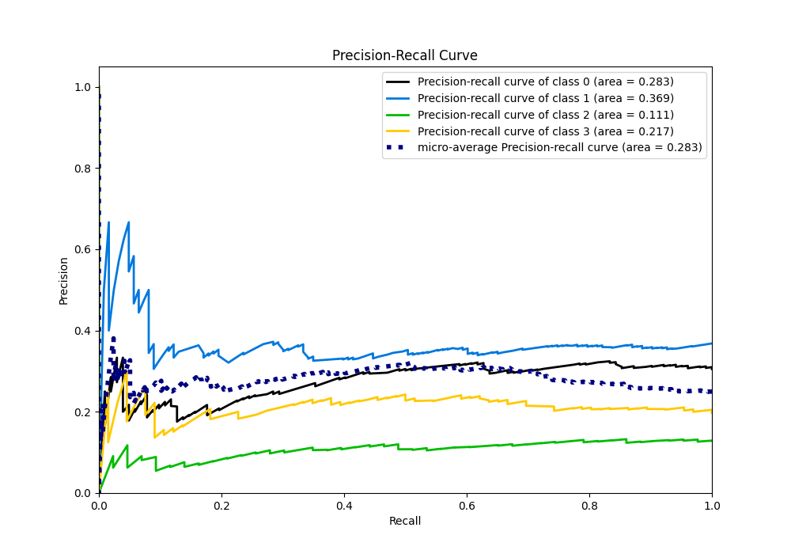

# Summary of 3_Linear

[<< Go back](../README.md)

## Logistic Regression (Linear)
- **n_jobs**: -1
- **num_class**: 4
- **explain_level**: 2

## Validation
 - **validation_type**: split
 - **train_ratio**: 0.75
 - **shuffle**: True
 - **stratify**: True

## Optimized metric
logloss

## Training time

2.4 seconds

### Metric details
|           |          0 |          1 |          2 |          3 |   accuracy |   macro avg |   weighted avg |   logloss |
|:----------|-----------:|-----------:|-----------:|-----------:|-----------:|------------:|---------------:|----------:|
| precision |   0.259259 |   0.355932 |  0.117647  |  0.1875    |   0.296407 |    0.230085 |       0.262449 |   1.78131 |
| recall    |   0.27451  |   0.512195 |  0.0465116 |  0.0909091 |   0.296407 |    0.231031 |       0.296407 |   1.78131 |
| f1-score  |   0.266667 |   0.42     |  0.0666667 |  0.122449  |   0.296407 |    0.218946 |       0.268887 |   1.78131 |
| support   | 102        | 123        | 43         | 66         |   0.296407 |  334        |     334        |   1.78131 |

## Confusion matrix
|              |   Predicted as 0 |   Predicted as 1 |   Predicted as 2 |   Predicted as 3 |
|:-------------|-----------------:|-----------------:|-----------------:|-----------------:|
| Labeled as 0 |               28 |               59 |                5 |               10 |
| Labeled as 1 |               45 |               63 |                6 |                9 |
| Labeled as 2 |               14 |               20 |                2 |                7 |
| Labeled as 3 |               21 |               35 |                4 |                6 |

## Learning curves

## Permutation-based Importance

## Confusion Matrix

## Normalized Confusion Matrix

## ROC Curve

## Precision Recall Curve

[<< Go back](../README.md)
