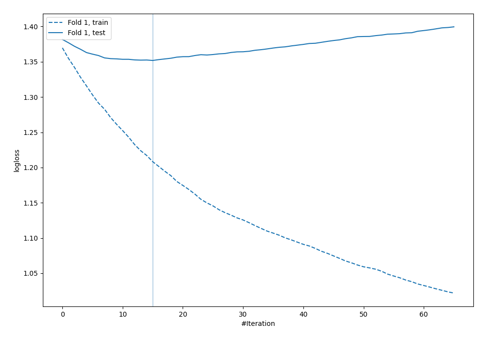
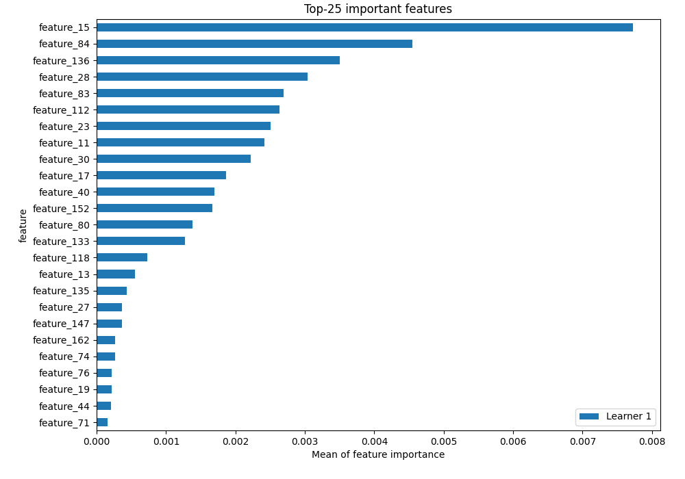
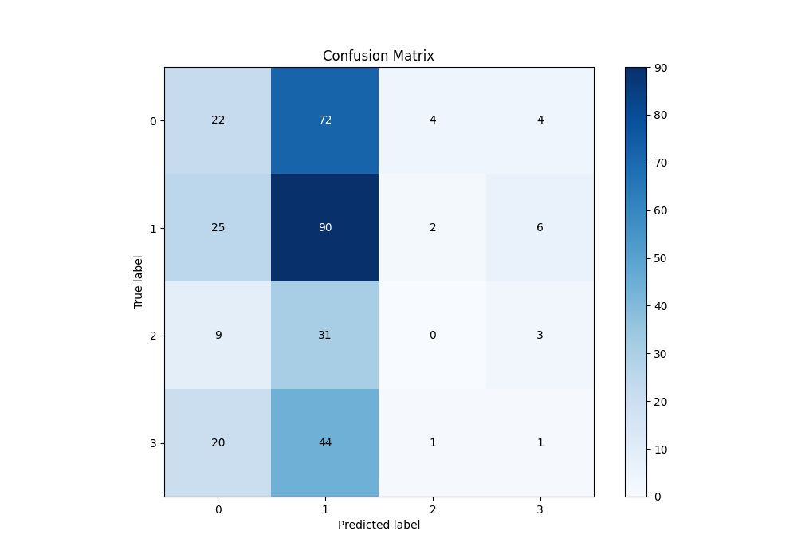
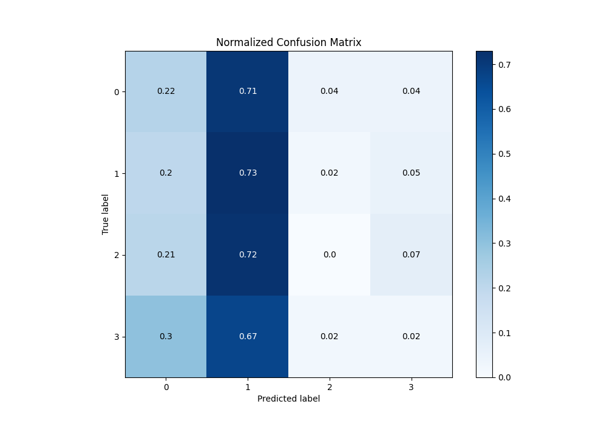
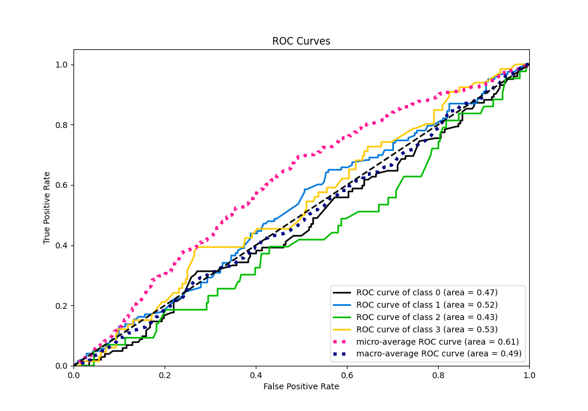
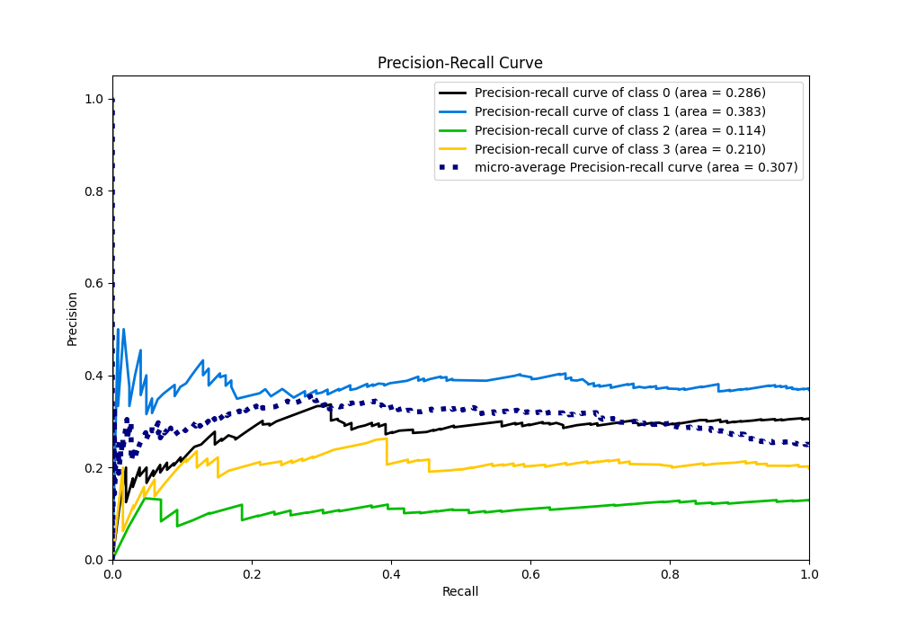

# Summary of 4_Default_Xgboost

[<< Go back](../README.md)

## Extreme Gradient Boosting (Xgboost)
- **n_jobs**: -1
- **objective**: multi:softprob
- **eta**: 0.075
- **max_depth**: 6
- **min_child_weight**: 1
- **subsample**: 1.0
- **colsample_bytree**: 1.0
- **eval_metric**: mlogloss
- **num_class**: 4
- **explain_level**: 2

## Validation
 - **validation_type**: split
 - **train_ratio**: 0.75
 - **shuffle**: True
 - **stratify**: True

## Optimized metric
logloss

## Training time

4.2 seconds

### Metric details
|           |          0 |          1 |   2 |          3 |   accuracy |   macro avg |   weighted avg |   logloss |
|:----------|-----------:|-----------:|----:|-----------:|-----------:|------------:|---------------:|----------:|
| precision |   0.289474 |   0.379747 |   0 |  0.0714286 |   0.338323 |    0.185162 |       0.242364 |   1.35186 |
| recall    |   0.215686 |   0.731707 |   0 |  0.0151515 |   0.338323 |    0.240636 |       0.338323 |   1.35186 |
| f1-score  |   0.247191 |   0.5      |   0 |  0.025     |   0.338323 |    0.193048 |       0.264561 |   1.35186 |
| support   | 102        | 123        |  43 | 66         |   0.338323 |  334        |     334        |   1.35186 |

## Confusion matrix
|              |   Predicted as 0 |   Predicted as 1 |   Predicted as 2 |   Predicted as 3 |
|:-------------|-----------------:|-----------------:|-----------------:|-----------------:|
| Labeled as 0 |               22 |               72 |                4 |                4 |
| Labeled as 1 |               25 |               90 |                2 |                6 |
| Labeled as 2 |                9 |               31 |                0 |                3 |
| Labeled as 3 |               20 |               44 |                1 |                1 |

## Learning curves

## Permutation-based Importance

## Confusion Matrix

## Normalized Confusion Matrix

## ROC Curve

## Precision Recall Curve

[<< Go back](../README.md)
