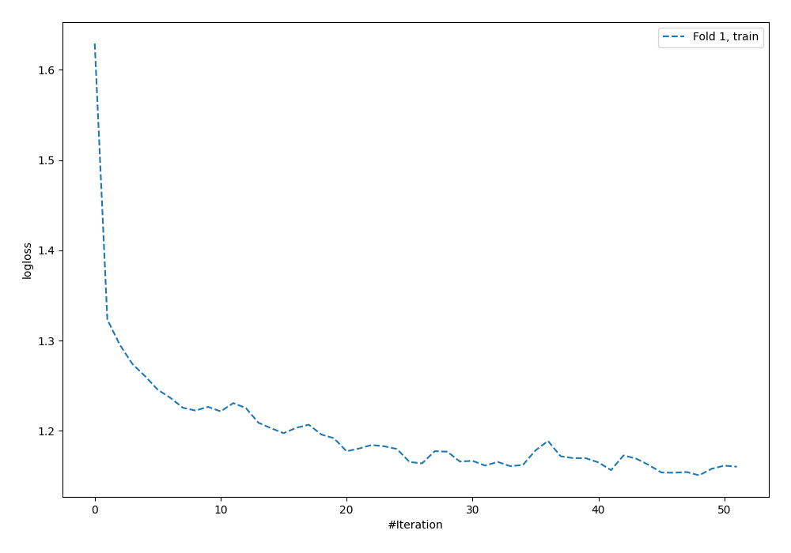
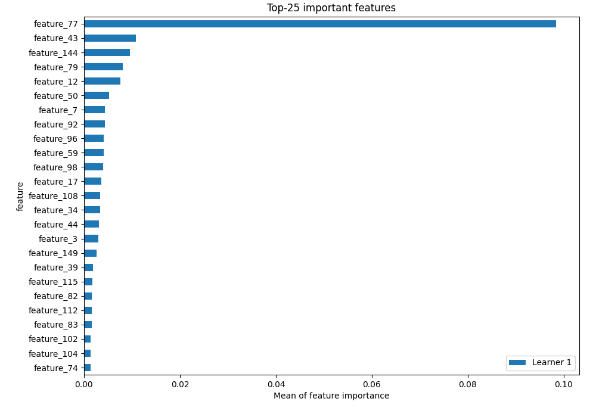
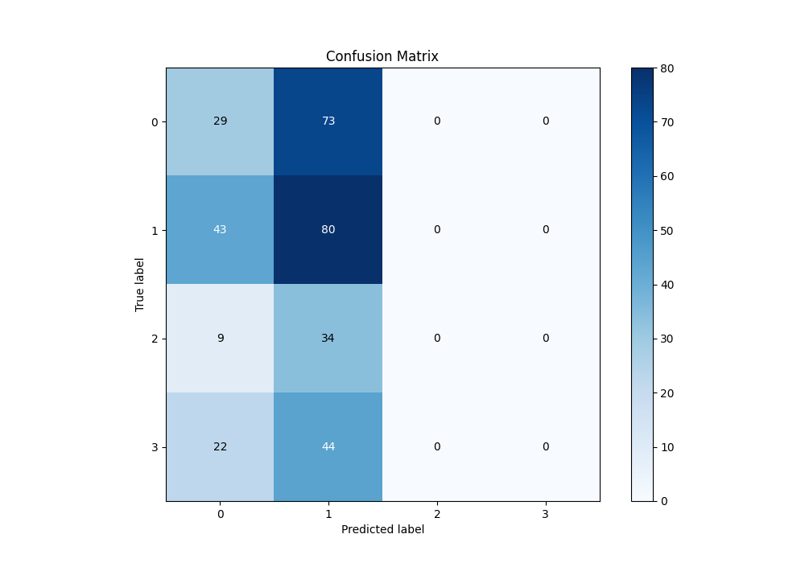
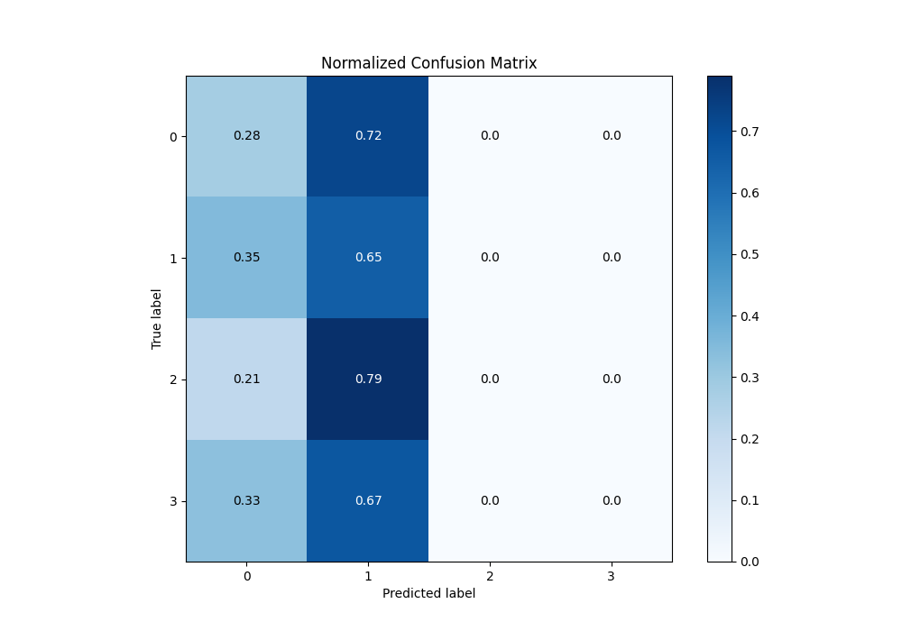
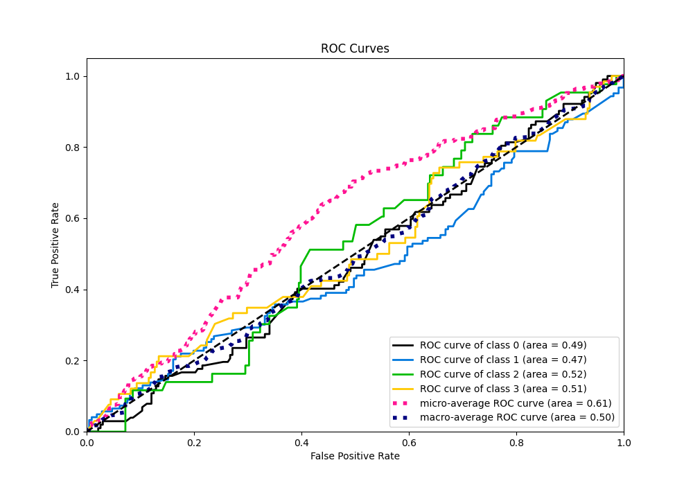
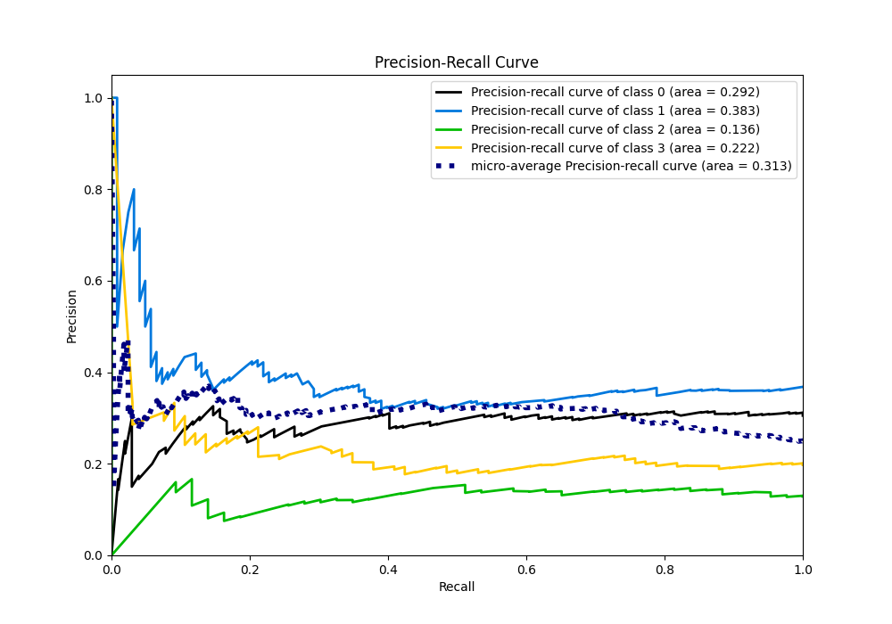

# Summary of 5_Default_NeuralNetwork

[<< Go back](../README.md)

## Neural Network
- **n_jobs**: -1
- **dense_1_size**: 32
- **dense_2_size**: 16
- **learning_rate**: 0.05
- **num_class**: 4
- **explain_level**: 2

## Validation
 - **validation_type**: split
 - **train_ratio**: 0.75
 - **shuffle**: True
 - **stratify**: True

## Optimized metric
logloss

## Training time

2.0 seconds

### Metric details
|           |          0 |          1 |   2 |   3 |   accuracy |   macro avg |   weighted avg |   logloss |
|:----------|-----------:|-----------:|----:|----:|-----------:|------------:|---------------:|----------:|
| precision |   0.281553 |   0.34632  |   0 |   0 |   0.326347 |    0.156968 |       0.213521 |    1.5169 |
| recall    |   0.284314 |   0.650407 |   0 |   0 |   0.326347 |    0.23368  |       0.326347 |    1.5169 |
| f1-score  |   0.282927 |   0.451977 |   0 |   0 |   0.326347 |    0.183726 |       0.25285  |    1.5169 |
| support   | 102        | 123        |  43 |  66 |   0.326347 |  334        |     334        |    1.5169 |

## Confusion matrix
|              |   Predicted as 0 |   Predicted as 1 |   Predicted as 2 |   Predicted as 3 |
|:-------------|-----------------:|-----------------:|-----------------:|-----------------:|
| Labeled as 0 |               29 |               73 |                0 |                0 |
| Labeled as 1 |               43 |               80 |                0 |                0 |
| Labeled as 2 |                9 |               34 |                0 |                0 |
| Labeled as 3 |               22 |               44 |                0 |                0 |

## Learning curves

## Permutation-based Importance

## Confusion Matrix

## Normalized Confusion Matrix

## ROC Curve

## Precision Recall Curve

[<< Go back](../README.md)
