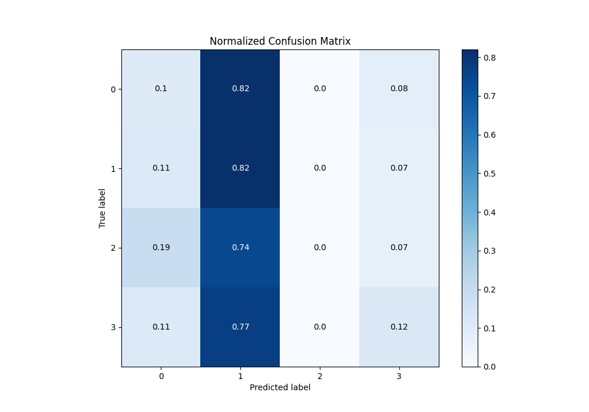

# Summary of 6_Default_RandomForest

[<< Go back](../README.md)

## Random Forest
- **n_jobs**: -1
- **criterion**: gini
- **max_features**: 0.9
- **min_samples_split**: 30
- **max_depth**: 4
- **eval_metric_name**: logloss
- **num_class**: 4
- **explain_level**: 2

## Validation
 - **validation_type**: split
 - **train_ratio**: 0.75
 - **shuffle**: True
 - **stratify**: True

## Optimized metric
logloss

## Training time

4.9 seconds

### Metric details
|           |           0 |          1 |   2 |         3 |   accuracy |   macro avg |   weighted avg |   logloss |
|:----------|------------:|-----------:|----:|----------:|-----------:|------------:|---------------:|----------:|
| precision |   0.25641   |   0.376866 |   0 |  0.296296 |   0.356287 |    0.232393 |       0.27564  |   1.32593 |
| recall    |   0.0980392 |   0.821138 |   0 |  0.121212 |   0.356287 |    0.260097 |       0.356287 |   1.32593 |
| f1-score  |   0.141844  |   0.516624 |   0 |  0.172043 |   0.356287 |    0.207628 |       0.267568 |   1.32593 |
| support   | 102         | 123        |  43 | 66        |   0.356287 |  334        |     334        |   1.32593 |

## Confusion matrix
|              |   Predicted as 0 |   Predicted as 1 |   Predicted as 2 |   Predicted as 3 |
|:-------------|-----------------:|-----------------:|-----------------:|-----------------:|
| Labeled as 0 |               10 |               84 |                0 |                8 |
| Labeled as 1 |               14 |              101 |                0 |                8 |
| Labeled as 2 |                8 |               32 |                0 |                3 |
| Labeled as 3 |                7 |               51 |                0 |                8 |

## Learning curves

## Permutation-based Importance

## Confusion Matrix

## Normalized Confusion Matrix

## ROC Curve

## Precision Recall Curve

[<< Go back](../README.md)
