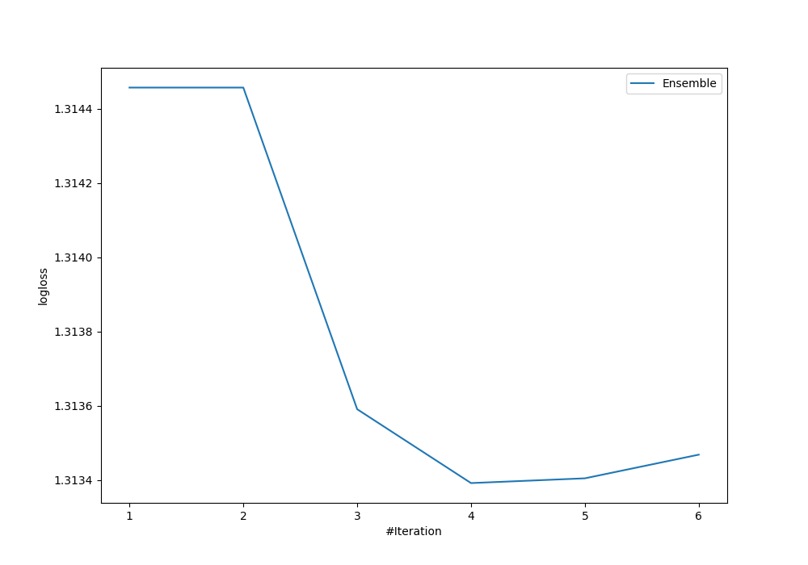

# Summary of Ensemble

[<< Go back](../README.md)

## Ensemble structure
| Model                  |   Weight |
|:-----------------------|---------:|
| 1_Baseline             |        3 |
| 6_Default_RandomForest |        1 |

### Metric details
|           |            0 |          1 |   2 |   3 |   accuracy |   macro avg |   weighted avg |   logloss |
|:----------|-------------:|-----------:|----:|----:|-----------:|------------:|---------------:|----------:|
| precision |   0.142857   |   0.366972 |   0 |   0 |   0.362275 |    0.127457 |       0.17877  |   1.31339 |
| recall    |   0.00980392 |   0.97561  |   0 |   0 |   0.362275 |    0.246353 |       0.362275 |   1.31339 |
| f1-score  |   0.0183486  |   0.533333 |   0 |   0 |   0.362275 |    0.13792  |       0.202011 |   1.31339 |
| support   | 102          | 123        |  43 |  66 |   0.362275 |  334        |     334        |   1.31339 |

## Confusion matrix
|              |   Predicted as 0 |   Predicted as 1 |   Predicted as 2 |   Predicted as 3 |
|:-------------|-----------------:|-----------------:|-----------------:|-----------------:|
| Labeled as 0 |                1 |              101 |                0 |                0 |
| Labeled as 1 |                3 |              120 |                0 |                0 |
| Labeled as 2 |                2 |               41 |                0 |                0 |
| Labeled as 3 |                1 |               65 |                0 |                0 |

## Learning curves

## Confusion Matrix

## Normalized Confusion Matrix

## ROC Curve

## Precision Recall Curve

[<< Go back](../README.md)
