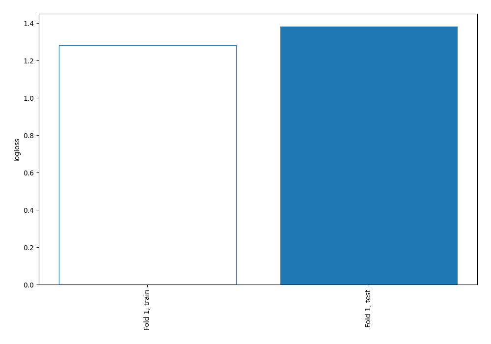
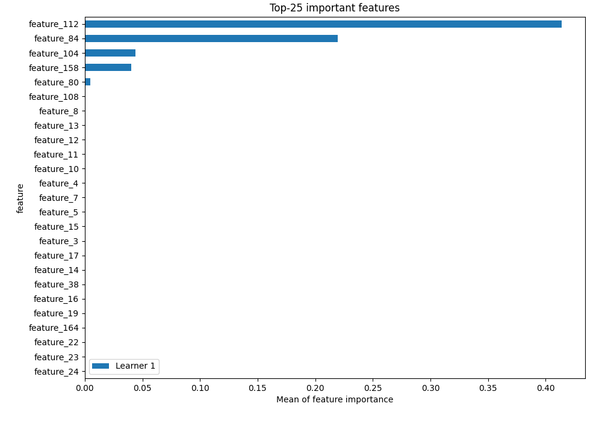
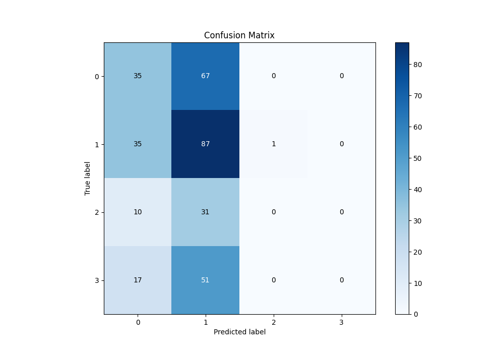
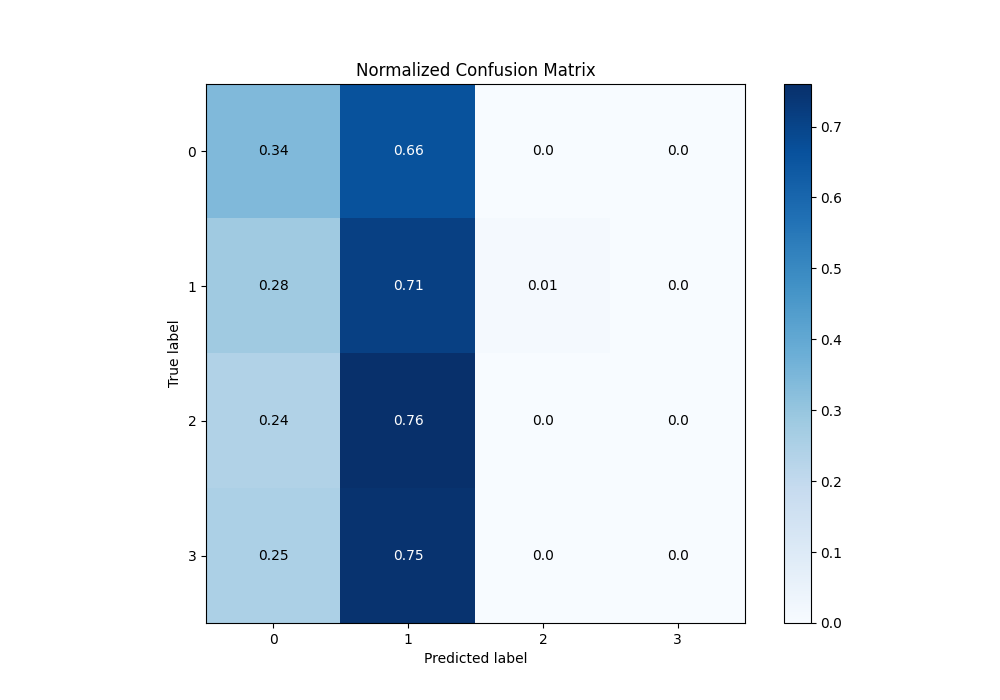
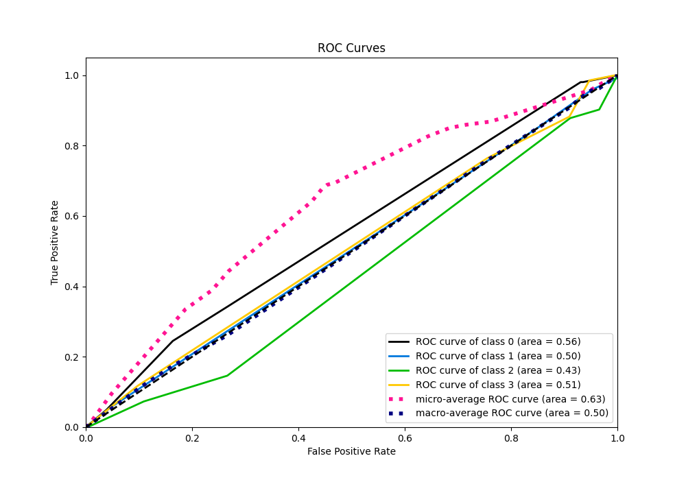
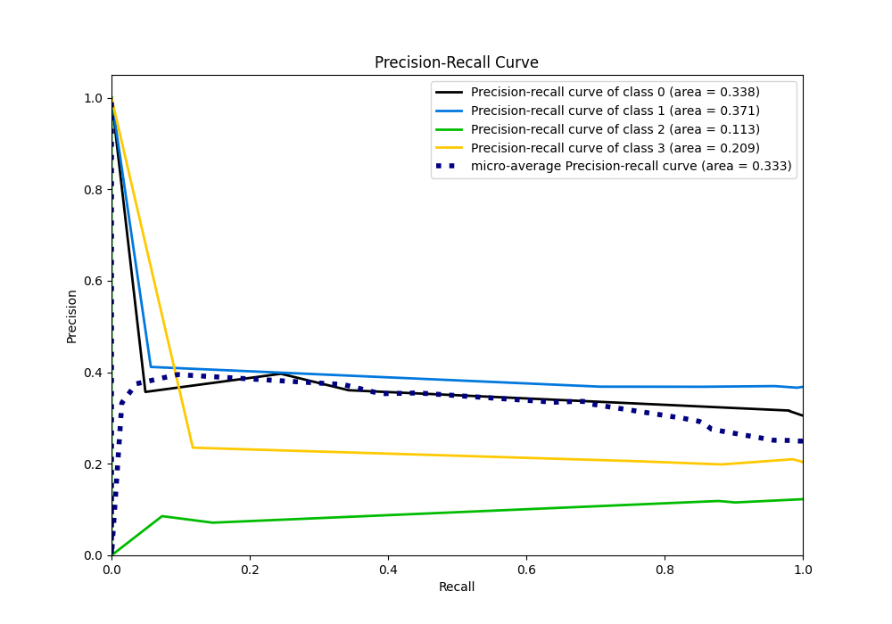

# Summary of 2_DecisionTree

[<< Go back](../README.md)

## Decision Tree
- **n_jobs**: -1
- **criterion**: gini
- **max_depth**: 3
- **num_class**: 4
- **explain_level**: 2

## Validation
 - **validation_type**: split
 - **train_ratio**: 0.75
 - **shuffle**: True
 - **stratify**: True

## Optimized metric
logloss

## Training time

3.4 seconds

### Metric details
|           |          0 |          1 |   2 |   3 |   accuracy |   macro avg |   weighted avg |   logloss |
|:----------|-----------:|-----------:|----:|----:|-----------:|------------:|---------------:|----------:|
| precision |   0.360825 |   0.368644 |   0 |   0 |   0.365269 |    0.182367 |       0.24595  |    1.3823 |
| recall    |   0.343137 |   0.707317 |   0 |   0 |   0.365269 |    0.262614 |       0.365269 |    1.3823 |
| f1-score  |   0.351759 |   0.48468  |   0 |   0 |   0.365269 |    0.20911  |       0.285913 |    1.3823 |
| support   | 102        | 123        |  41 |  68 |   0.365269 |  334        |     334        |    1.3823 |

## Confusion matrix
|              |   Predicted as 0 |   Predicted as 1 |   Predicted as 2 |   Predicted as 3 |
|:-------------|-----------------:|-----------------:|-----------------:|-----------------:|
| Labeled as 0 |               35 |               67 |                0 |                0 |
| Labeled as 1 |               35 |               87 |                1 |                0 |
| Labeled as 2 |               10 |               31 |                0 |                0 |
| Labeled as 3 |               17 |               51 |                0 |                0 |

## Learning curves

## Permutation-based Importance

## Confusion Matrix

## Normalized Confusion Matrix

## ROC Curve

## Precision Recall Curve

[<< Go back](../README.md)
