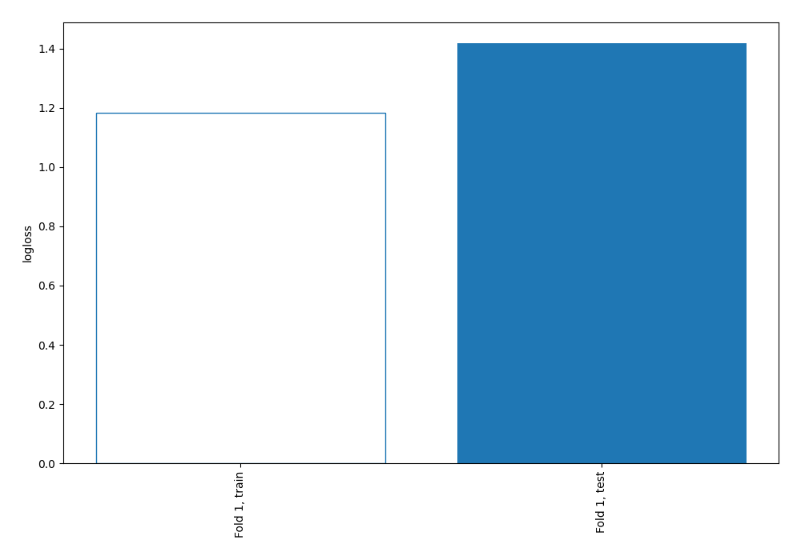
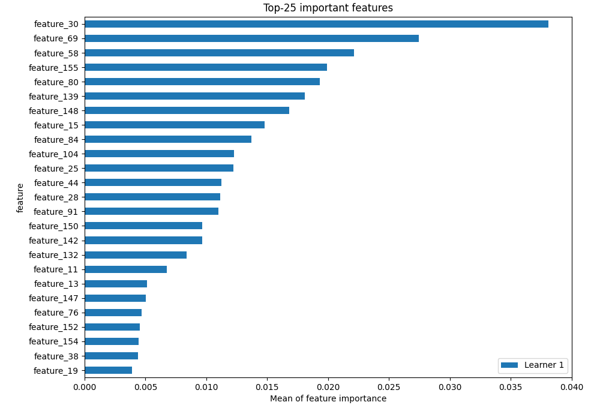
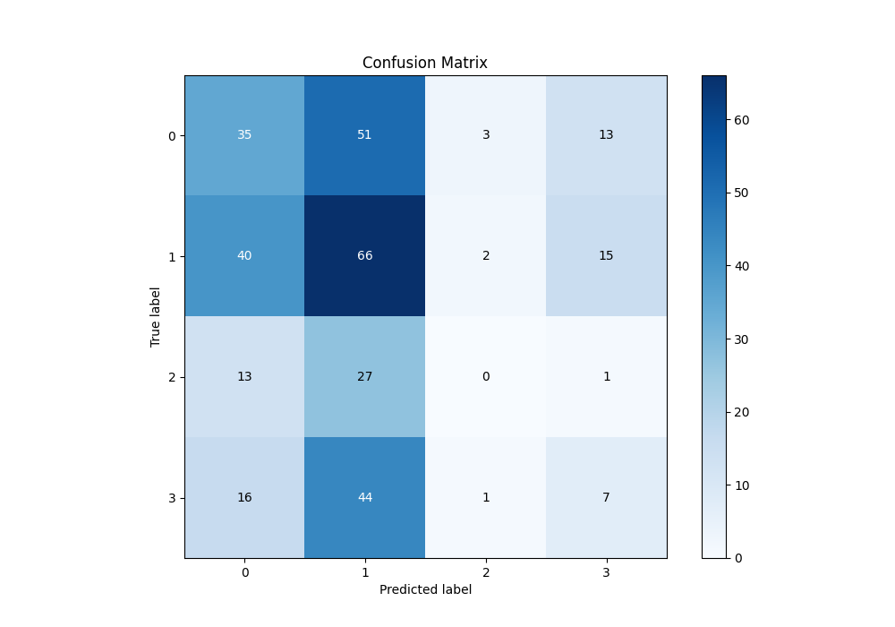
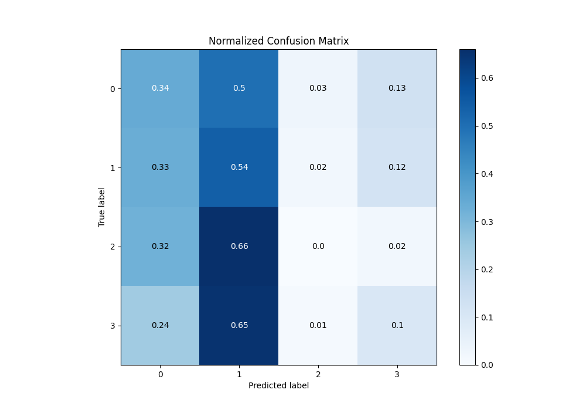
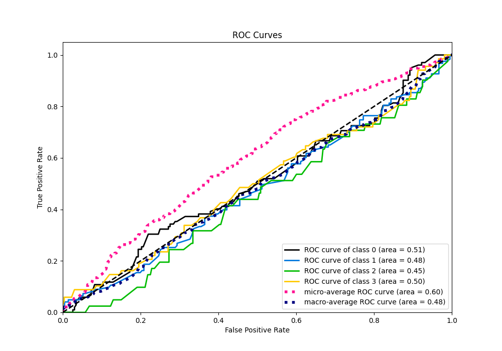
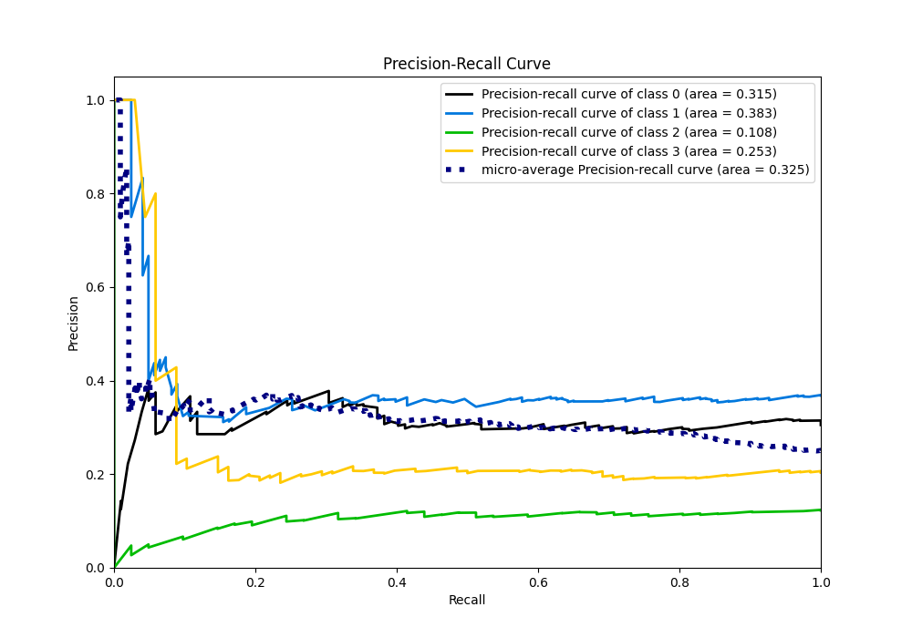

# Summary of 3_Linear

[<< Go back](../README.md)

## Logistic Regression (Linear)
- **n_jobs**: -1
- **num_class**: 4
- **explain_level**: 2

## Validation
 - **validation_type**: split
 - **train_ratio**: 0.75
 - **shuffle**: True
 - **stratify**: True

## Optimized metric
logloss

## Training time

2.3 seconds

### Metric details
|           |          0 |          1 |   2 |         3 |   accuracy |   macro avg |   weighted avg |   logloss |
|:----------|-----------:|-----------:|----:|----------:|-----------:|------------:|---------------:|----------:|
| precision |   0.336538 |   0.351064 |   0 |  0.194444 |   0.323353 |    0.220512 |       0.271647 |   1.41746 |
| recall    |   0.343137 |   0.536585 |   0 |  0.102941 |   0.323353 |    0.245666 |       0.323353 |   1.41746 |
| f1-score  |   0.339806 |   0.424437 |   0 |  0.134615 |   0.323353 |    0.224715 |       0.287485 |   1.41746 |
| support   | 102        | 123        |  41 | 68        |   0.323353 |  334        |     334        |   1.41746 |

## Confusion matrix
|              |   Predicted as 0 |   Predicted as 1 |   Predicted as 2 |   Predicted as 3 |
|:-------------|-----------------:|-----------------:|-----------------:|-----------------:|
| Labeled as 0 |               35 |               51 |                3 |               13 |
| Labeled as 1 |               40 |               66 |                2 |               15 |
| Labeled as 2 |               13 |               27 |                0 |                1 |
| Labeled as 3 |               16 |               44 |                1 |                7 |

## Learning curves

## Permutation-based Importance

## Confusion Matrix

## Normalized Confusion Matrix

## ROC Curve

## Precision Recall Curve

[<< Go back](../README.md)
