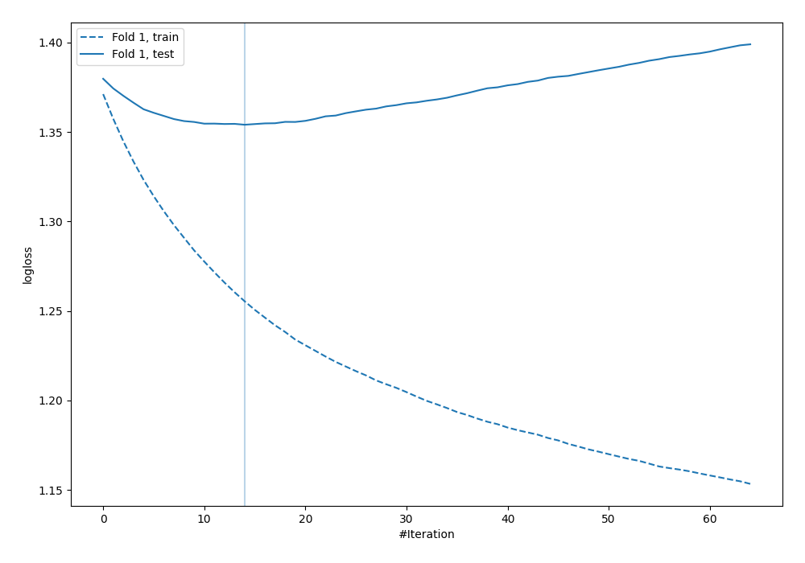
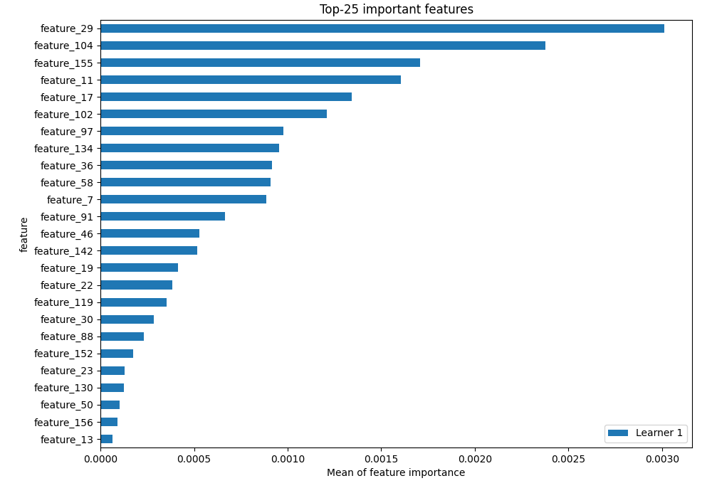
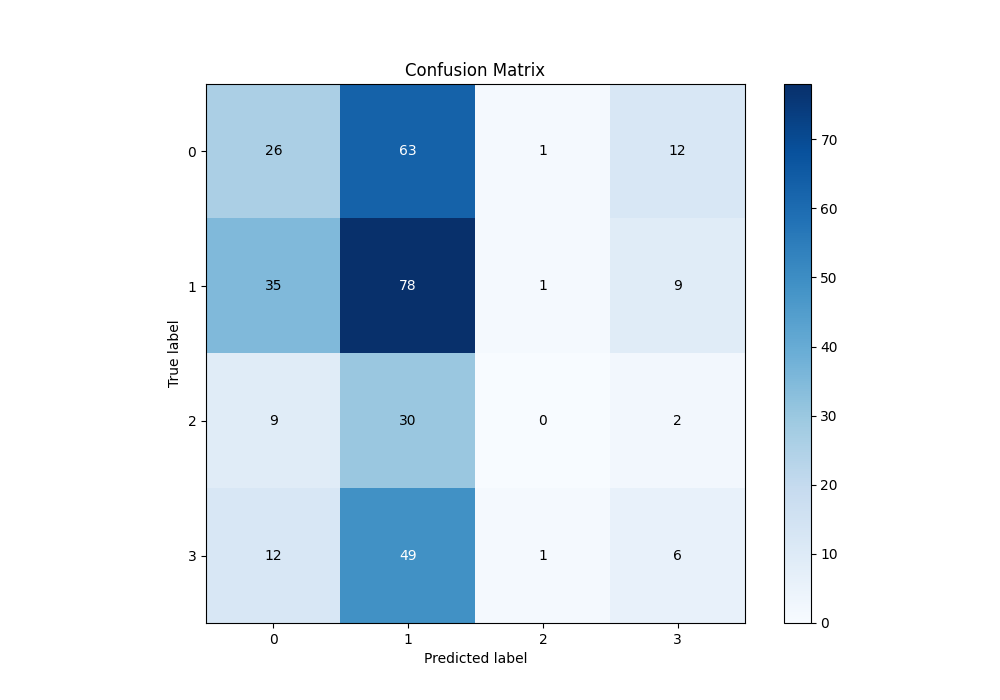
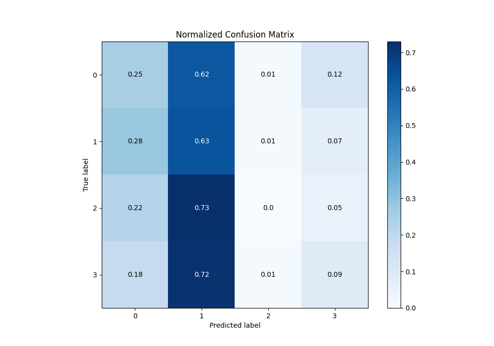
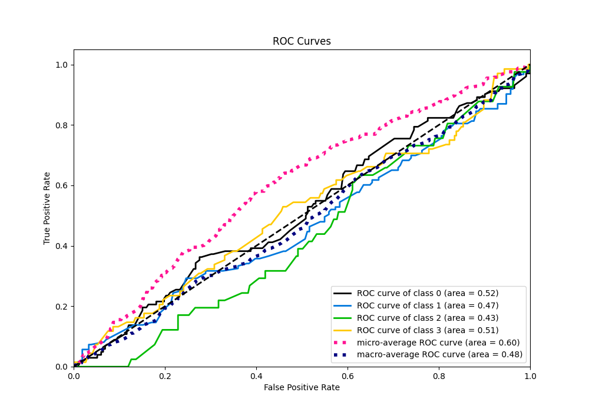
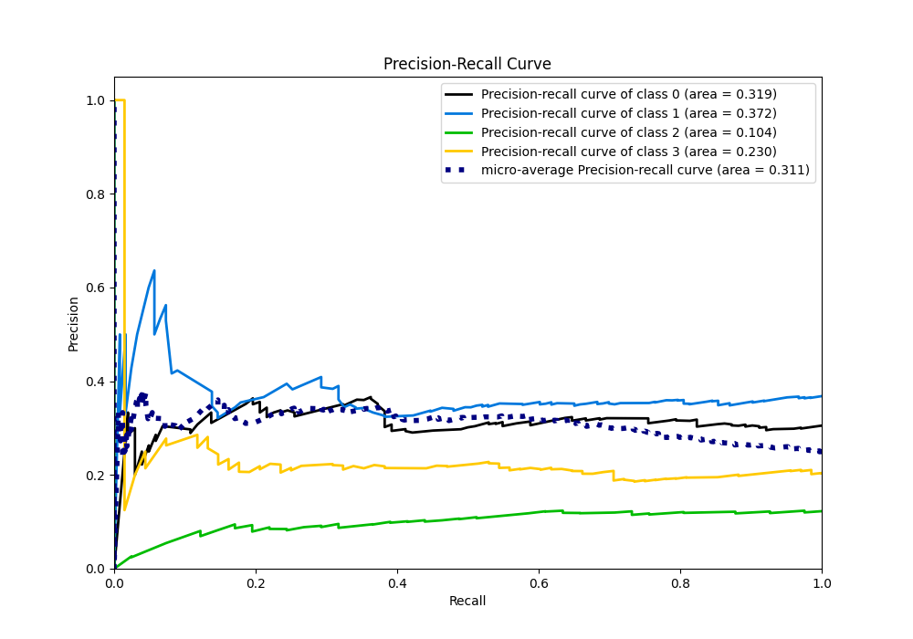

# Summary of 4_Default_Xgboost

[<< Go back](../README.md)

## Extreme Gradient Boosting (Xgboost)
- **n_jobs**: -1
- **objective**: multi:softprob
- **eta**: 0.075
- **max_depth**: 6
- **min_child_weight**: 1
- **subsample**: 1.0
- **colsample_bytree**: 1.0
- **eval_metric**: mlogloss
- **num_class**: 4
- **explain_level**: 2

## Validation
 - **validation_type**: split
 - **train_ratio**: 0.75
 - **shuffle**: True
 - **stratify**: True

## Optimized metric
logloss

## Training time

3.6 seconds

### Metric details
|           |          0 |          1 |   2 |          3 |   accuracy |   macro avg |   weighted avg |   logloss |
|:----------|-----------:|-----------:|----:|-----------:|-----------:|------------:|---------------:|----------:|
| precision |   0.317073 |   0.354545 |   0 |  0.206897  |   0.329341 |    0.219629 |       0.26952  |   1.35404 |
| recall    |   0.254902 |   0.634146 |   0 |  0.0882353 |   0.329341 |    0.244321 |       0.329341 |   1.35404 |
| f1-score  |   0.282609 |   0.45481  |   0 |  0.123711  |   0.329341 |    0.215283 |       0.278982 |   1.35404 |
| support   | 102        | 123        |  41 | 68         |   0.329341 |  334        |     334        |   1.35404 |

## Confusion matrix
|              |   Predicted as 0 |   Predicted as 1 |   Predicted as 2 |   Predicted as 3 |
|:-------------|-----------------:|-----------------:|-----------------:|-----------------:|
| Labeled as 0 |               26 |               63 |                1 |               12 |
| Labeled as 1 |               35 |               78 |                1 |                9 |
| Labeled as 2 |                9 |               30 |                0 |                2 |
| Labeled as 3 |               12 |               49 |                1 |                6 |

## Learning curves

## Permutation-based Importance

## Confusion Matrix

## Normalized Confusion Matrix

## ROC Curve

## Precision Recall Curve

[<< Go back](../README.md)
