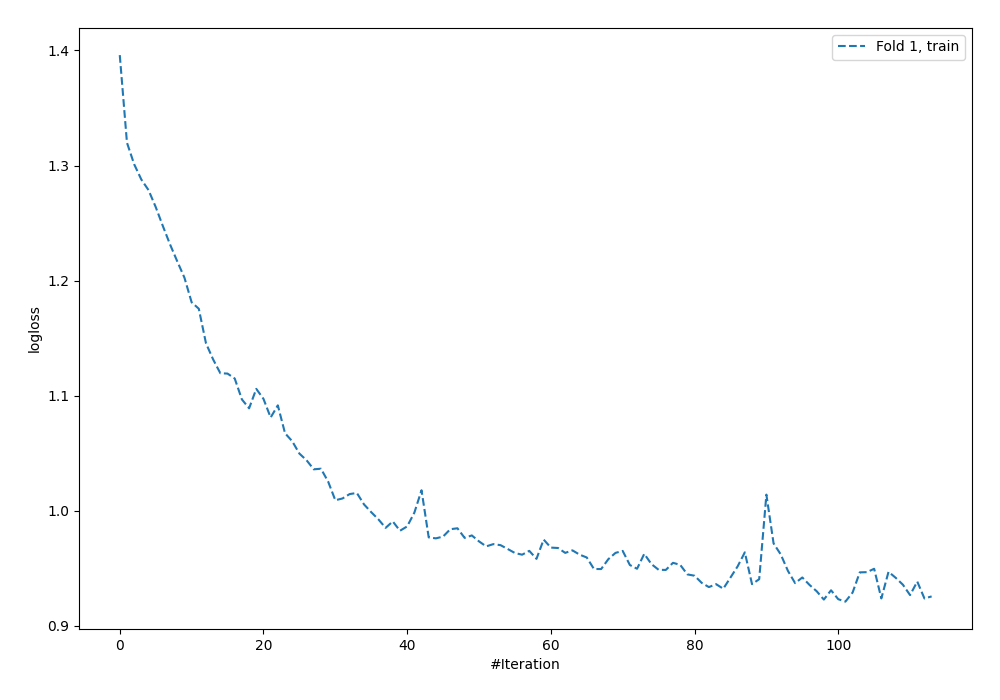
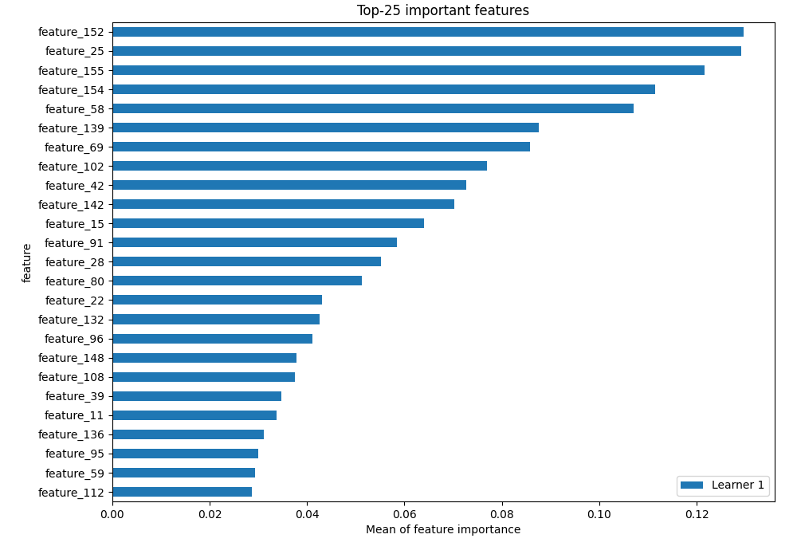
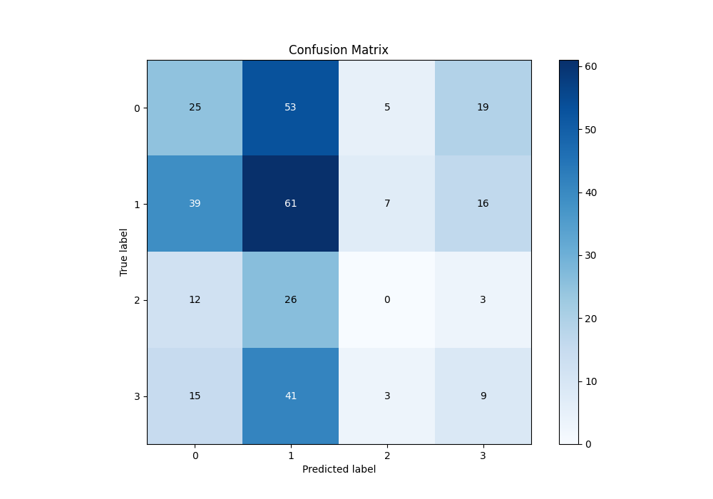
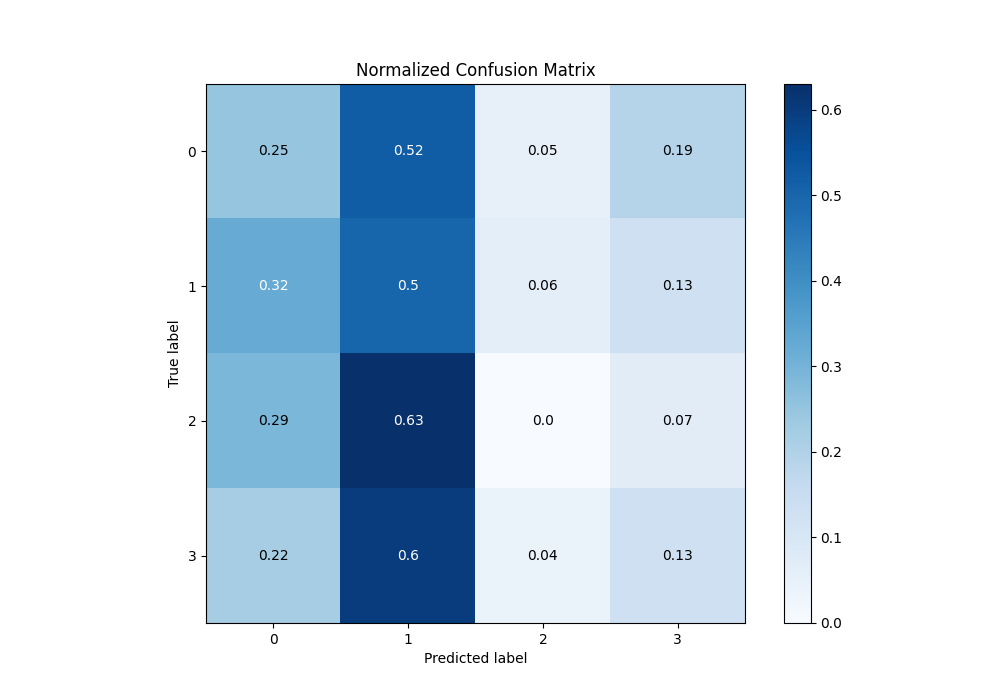
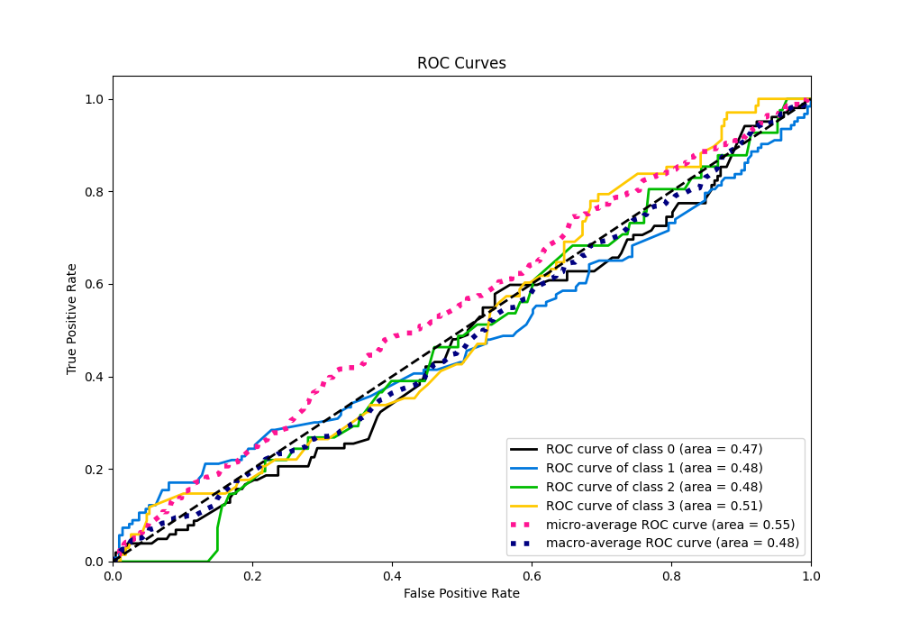
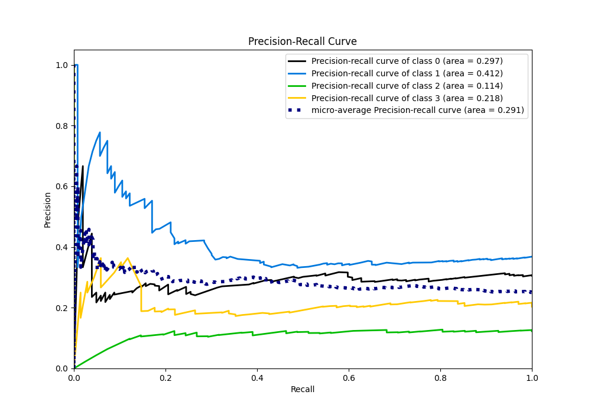

# Summary of 5_Default_NeuralNetwork

[<< Go back](../README.md)

## Neural Network
- **n_jobs**: -1
- **dense_1_size**: 32
- **dense_2_size**: 16
- **learning_rate**: 0.05
- **num_class**: 4
- **explain_level**: 2

## Validation
 - **validation_type**: split
 - **train_ratio**: 0.75
 - **shuffle**: True
 - **stratify**: True

## Optimized metric
logloss

## Training time

2.4 seconds

### Metric details
|           |          0 |          1 |   2 |         3 |   accuracy |   macro avg |   weighted avg |   logloss |
|:----------|-----------:|-----------:|----:|----------:|-----------:|------------:|---------------:|----------:|
| precision |   0.274725 |   0.337017 |   0 |  0.191489 |   0.284431 |    0.200808 |       0.246995 |   2.10467 |
| recall    |   0.245098 |   0.495935 |   0 |  0.132353 |   0.284431 |    0.218346 |       0.284431 |   2.10467 |
| f1-score  |   0.259067 |   0.401316 |   0 |  0.156522 |   0.284431 |    0.204226 |       0.258773 |   2.10467 |
| support   | 102        | 123        |  41 | 68        |   0.284431 |  334        |     334        |   2.10467 |

## Confusion matrix
|              |   Predicted as 0 |   Predicted as 1 |   Predicted as 2 |   Predicted as 3 |
|:-------------|-----------------:|-----------------:|-----------------:|-----------------:|
| Labeled as 0 |               25 |               53 |                5 |               19 |
| Labeled as 1 |               39 |               61 |                7 |               16 |
| Labeled as 2 |               12 |               26 |                0 |                3 |
| Labeled as 3 |               15 |               41 |                3 |                9 |

## Learning curves

## Permutation-based Importance

## Confusion Matrix

## Normalized Confusion Matrix

## ROC Curve

## Precision Recall Curve

[<< Go back](../README.md)
