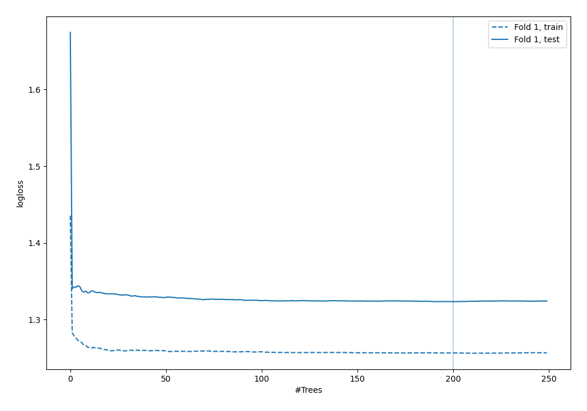
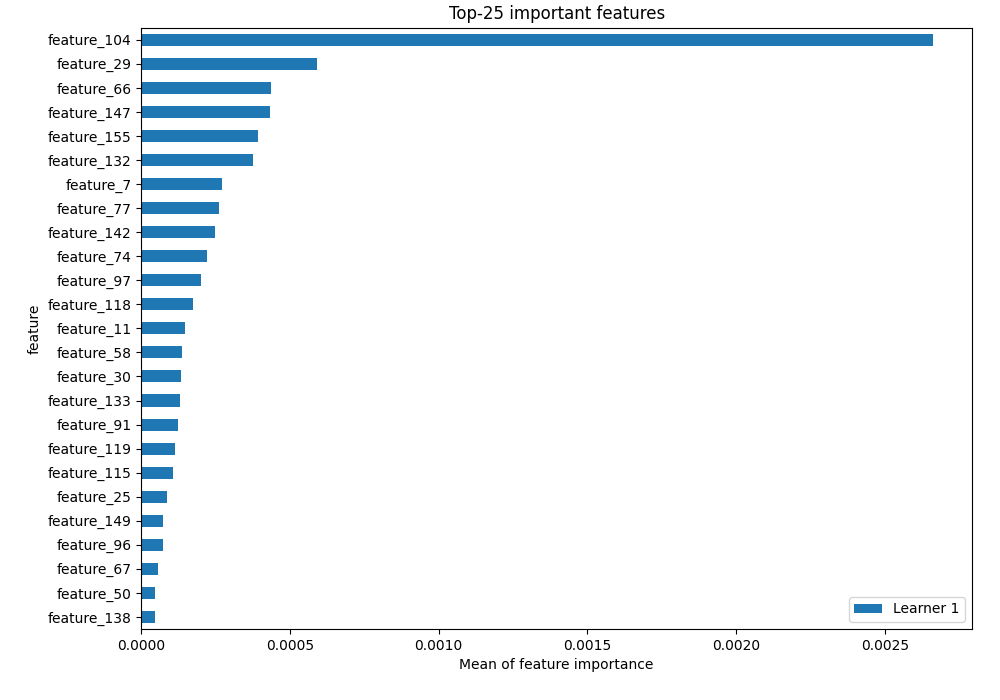
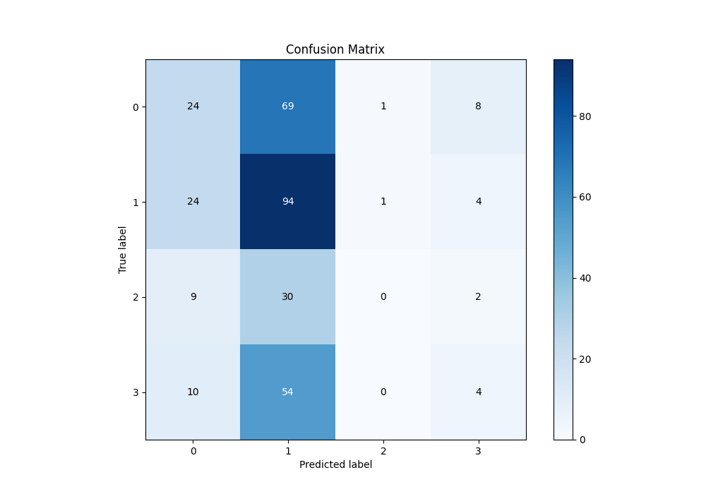
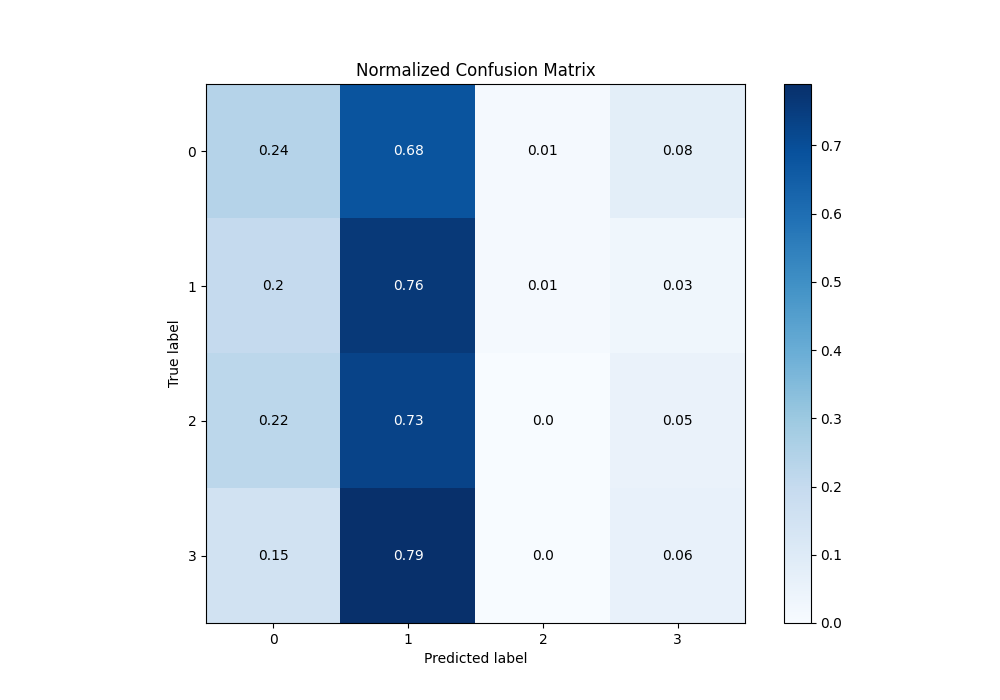
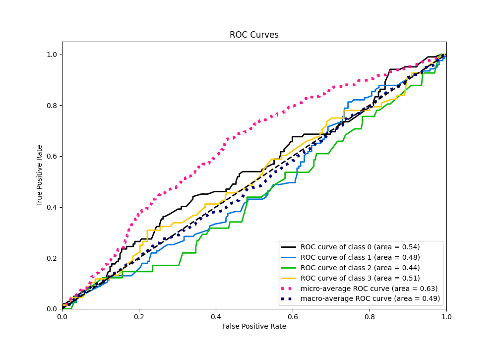
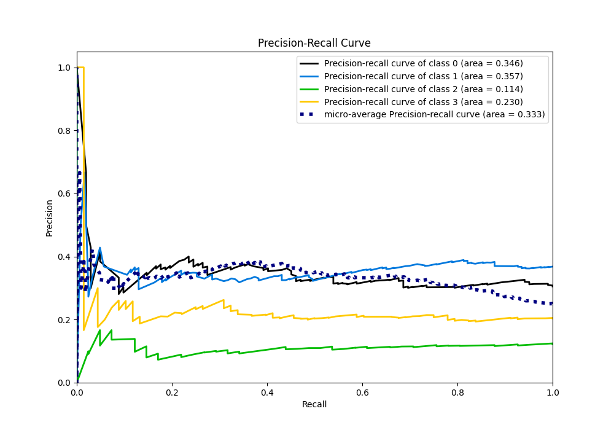

# Summary of 6_Default_RandomForest

[<< Go back](../README.md)

## Random Forest
- **n_jobs**: -1
- **criterion**: gini
- **max_features**: 0.9
- **min_samples_split**: 30
- **max_depth**: 4
- **eval_metric_name**: logloss
- **num_class**: 4
- **explain_level**: 2

## Validation
 - **validation_type**: split
 - **train_ratio**: 0.75
 - **shuffle**: True
 - **stratify**: True

## Optimized metric
logloss

## Training time

18.4 seconds

### Metric details
|           |          0 |          1 |   2 |          3 |   accuracy |   macro avg |   weighted avg |   logloss |
|:----------|-----------:|-----------:|----:|-----------:|-----------:|------------:|---------------:|----------:|
| precision |   0.358209 |   0.380567 |   0 |  0.222222  |   0.365269 |    0.240249 |       0.294785 |   1.32322 |
| recall    |   0.235294 |   0.764228 |   0 |  0.0588235 |   0.365269 |    0.264586 |       0.365269 |   1.32322 |
| f1-score  |   0.284024 |   0.508108 |   0 |  0.0930233 |   0.365269 |    0.221289 |       0.292794 |   1.32322 |
| support   | 102        | 123        |  41 | 68         |   0.365269 |  334        |     334        |   1.32322 |

## Confusion matrix
|              |   Predicted as 0 |   Predicted as 1 |   Predicted as 2 |   Predicted as 3 |
|:-------------|-----------------:|-----------------:|-----------------:|-----------------:|
| Labeled as 0 |               24 |               69 |                1 |                8 |
| Labeled as 1 |               24 |               94 |                1 |                4 |
| Labeled as 2 |                9 |               30 |                0 |                2 |
| Labeled as 3 |               10 |               54 |                0 |                4 |

## Learning curves

## Permutation-based Importance

## Confusion Matrix

## Normalized Confusion Matrix

## ROC Curve

## Precision Recall Curve

[<< Go back](../README.md)
