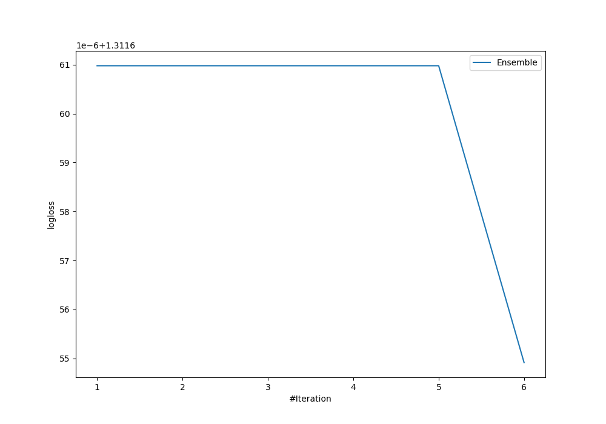
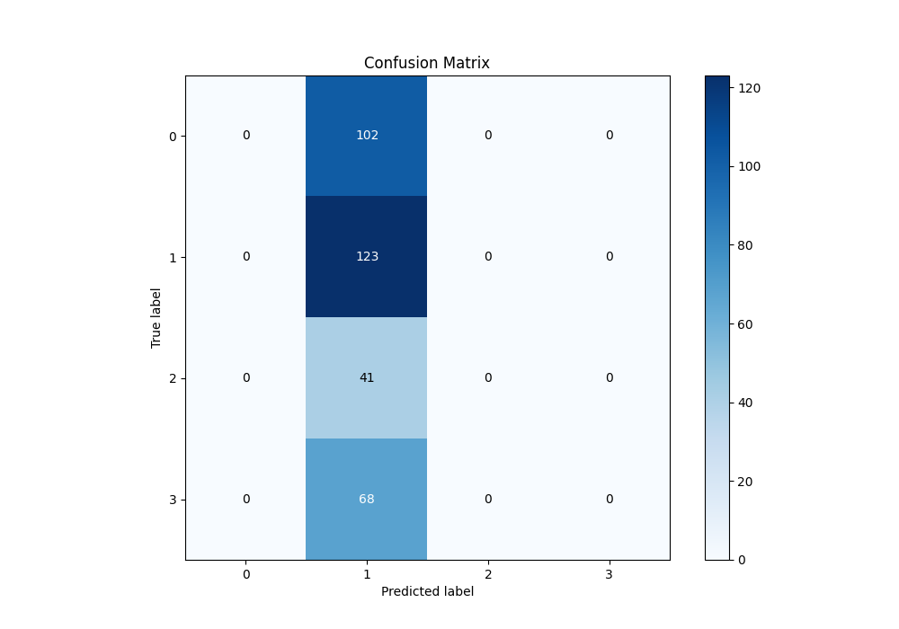
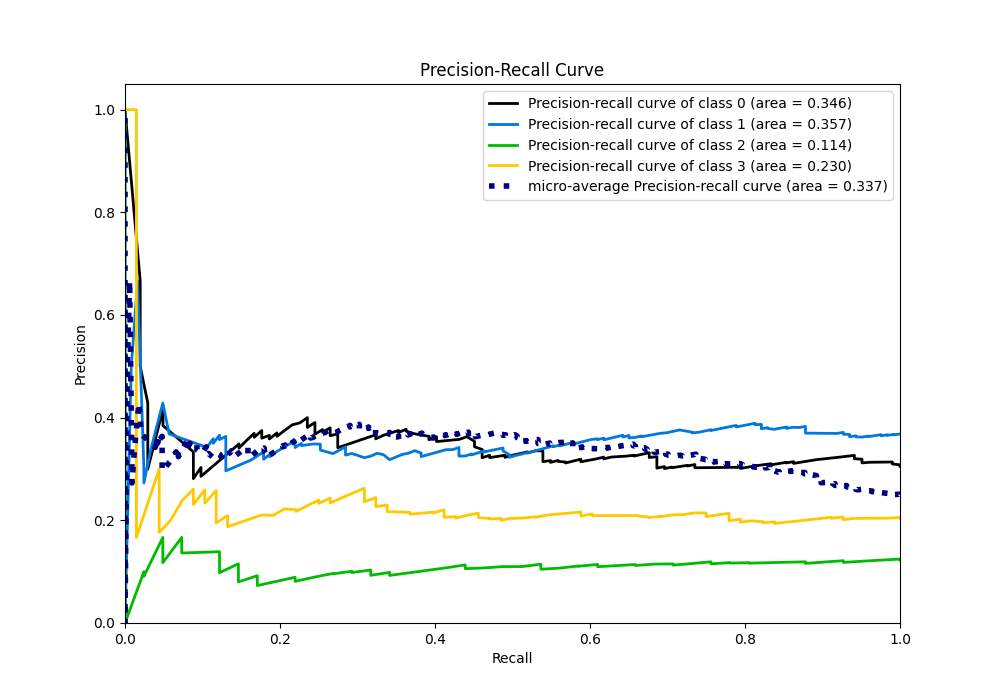

# Summary of Ensemble

[<< Go back](../README.md)

## Ensemble structure
| Model                  |   Weight |
|:-----------------------|---------:|
| 1_Baseline             |        5 |
| 6_Default_RandomForest |        1 |

### Metric details
|           |   0 |          1 |   2 |   3 |   accuracy |   macro avg |   weighted avg |   logloss |
|:----------|----:|-----------:|----:|----:|-----------:|------------:|---------------:|----------:|
| precision |   0 |   0.368263 |   0 |   0 |   0.368263 |   0.0920659 |       0.135618 |   1.31165 |
| recall    |   0 |   1        |   0 |   0 |   0.368263 |   0.25      |       0.368263 |   1.31165 |
| f1-score  |   0 |   0.538293 |   0 |   0 |   0.368263 |   0.134573  |       0.198234 |   1.31165 |
| support   | 102 | 123        |  41 |  68 |   0.368263 | 334         |     334        |   1.31165 |

## Confusion matrix
|              |   Predicted as 0 |   Predicted as 1 |   Predicted as 2 |   Predicted as 3 |
|:-------------|-----------------:|-----------------:|-----------------:|-----------------:|
| Labeled as 0 |                0 |              102 |                0 |                0 |
| Labeled as 1 |                0 |              123 |                0 |                0 |
| Labeled as 2 |                0 |               41 |                0 |                0 |
| Labeled as 3 |                0 |               68 |                0 |                0 |

## Learning curves

## Confusion Matrix

## Normalized Confusion Matrix

## ROC Curve

## Precision Recall Curve

[<< Go back](../README.md)
