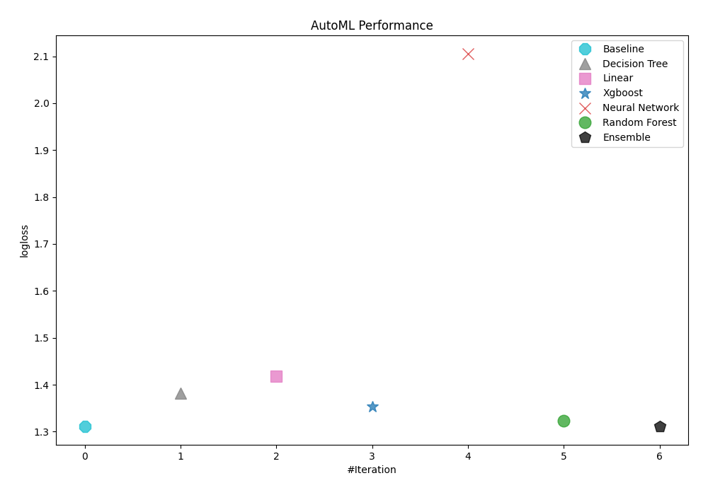
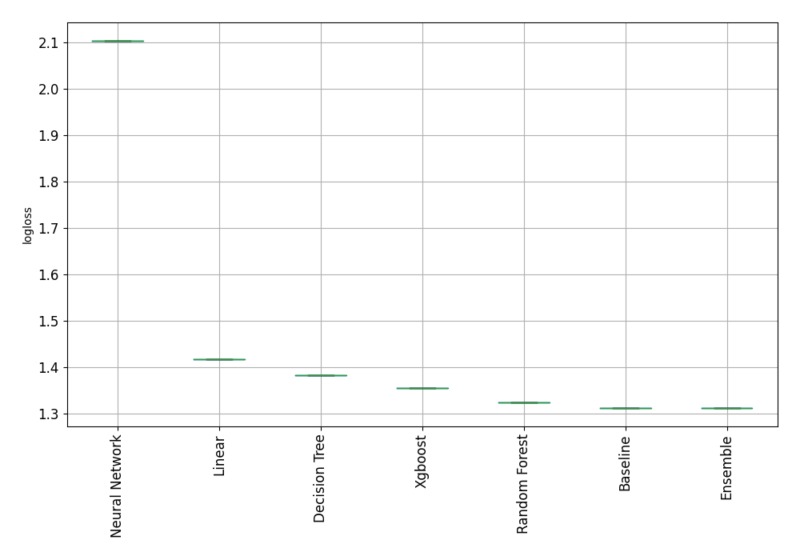

# AutoML Leaderboard

| Best model   | name                                                         | model_type     | metric_type   |   metric_value |   train_time |
|:-------------|:-------------------------------------------------------------|:---------------|:--------------|---------------:|-------------:|
|              | [1_Baseline](1_Baseline/README.md)                           | Baseline       | logloss       |        1.31166 |         1.38 |
|              | [2_DecisionTree](2_DecisionTree/README.md)                   | Decision Tree  | logloss       |        1.3823  |         4.53 |
|              | [3_Linear](3_Linear/README.md)                               | Linear         | logloss       |        1.41746 |         3.47 |
|              | [4_Default_Xgboost](4_Default_Xgboost/README.md)             | Xgboost        | logloss       |        1.35404 |         4.72 |
|              | [5_Default_NeuralNetwork](5_Default_NeuralNetwork/README.md) | Neural Network | logloss       |        2.10467 |         3.58 |
|              | [6_Default_RandomForest](6_Default_RandomForest/README.md)   | Random Forest  | logloss       |        1.32322 |        19.57 |
| **the best** | [Ensemble](Ensemble/README.md)                               | Ensemble       | logloss       |        1.31165 |         0.59 |

### AutoML Performance

### AutoML Performance Boxplot
