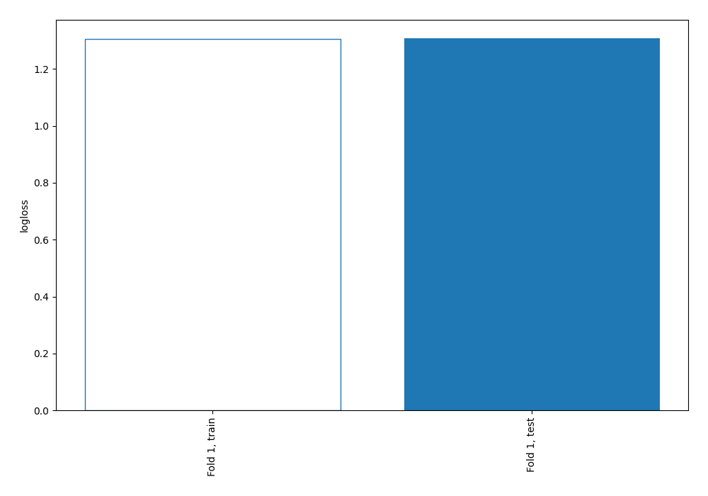
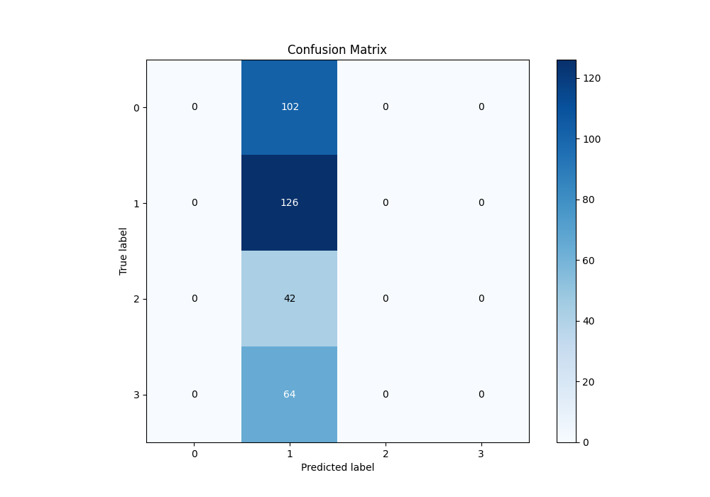
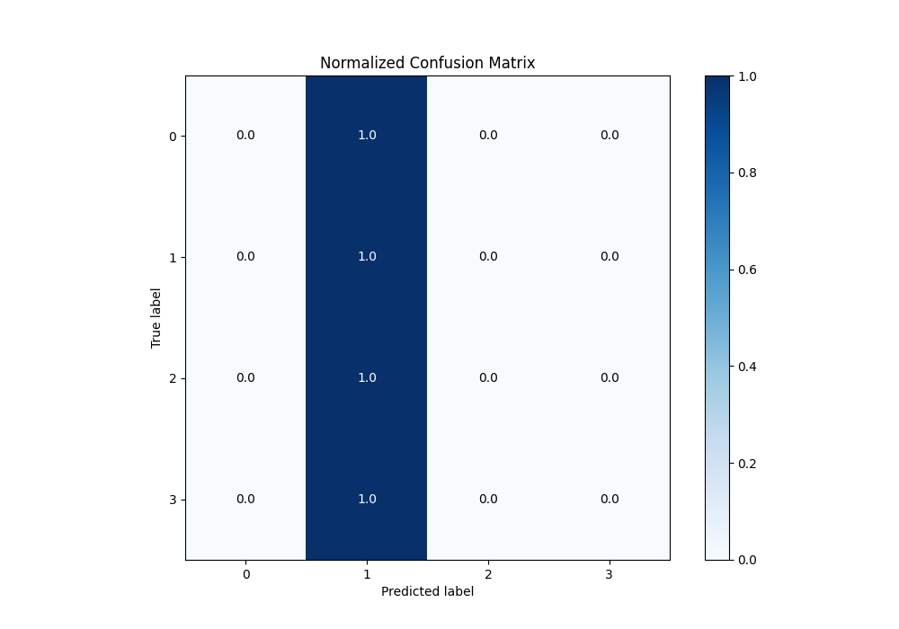
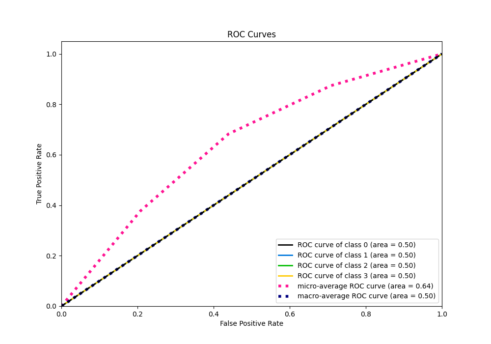
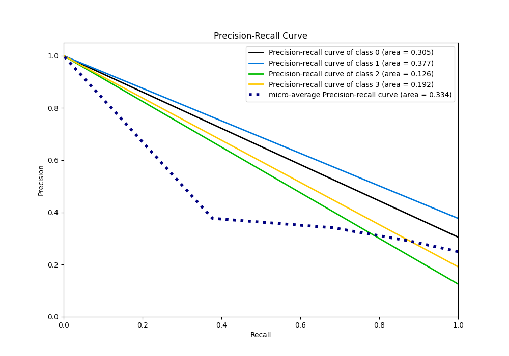

# Summary of 1_Baseline

[<< Go back](../README.md)

## Baseline Classifier (Baseline)
- **n_jobs**: -1
- **num_class**: 4
- **explain_level**: 2

## Validation
 - **validation_type**: split
 - **train_ratio**: 0.75
 - **shuffle**: True
 - **stratify**: True

## Optimized metric
logloss

## Training time

0.8 seconds

### Metric details
|           |   0 |          1 |   2 |   3 |   accuracy |   macro avg |   weighted avg |   logloss |
|:----------|----:|-----------:|----:|----:|-----------:|------------:|---------------:|----------:|
| precision |   0 |   0.377246 |   0 |   0 |   0.377246 |   0.0943114 |       0.142314 |   1.30735 |
| recall    |   0 |   1        |   0 |   0 |   0.377246 |   0.25      |       0.377246 |   1.30735 |
| f1-score  |   0 |   0.547826 |   0 |   0 |   0.377246 |   0.136957  |       0.206665 |   1.30735 |
| support   | 102 | 126        |  42 |  64 |   0.377246 | 334         |     334        |   1.30735 |

## Confusion matrix
|              |   Predicted as 0 |   Predicted as 1 |   Predicted as 2 |   Predicted as 3 |
|:-------------|-----------------:|-----------------:|-----------------:|-----------------:|
| Labeled as 0 |                0 |              102 |                0 |                0 |
| Labeled as 1 |                0 |              126 |                0 |                0 |
| Labeled as 2 |                0 |               42 |                0 |                0 |
| Labeled as 3 |                0 |               64 |                0 |                0 |

## Learning curves

## Confusion Matrix

## Normalized Confusion Matrix

## ROC Curve

## Precision Recall Curve

[<< Go back](../README.md)
