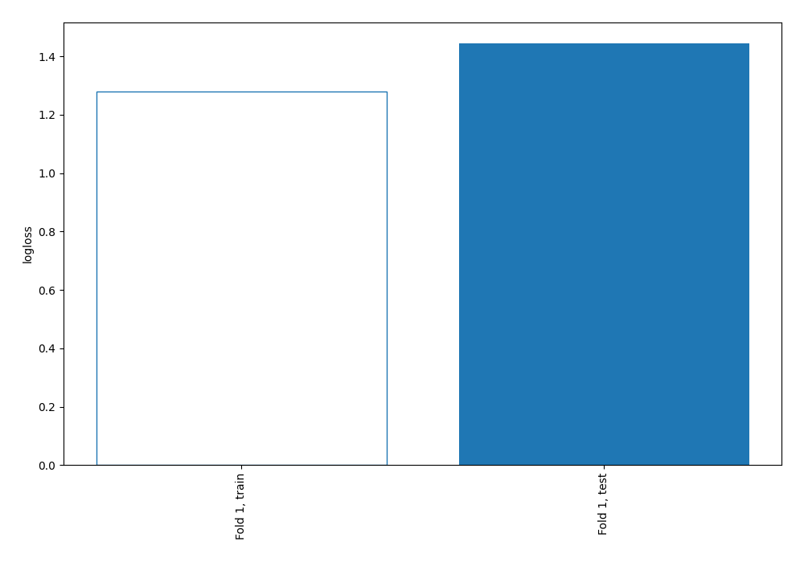
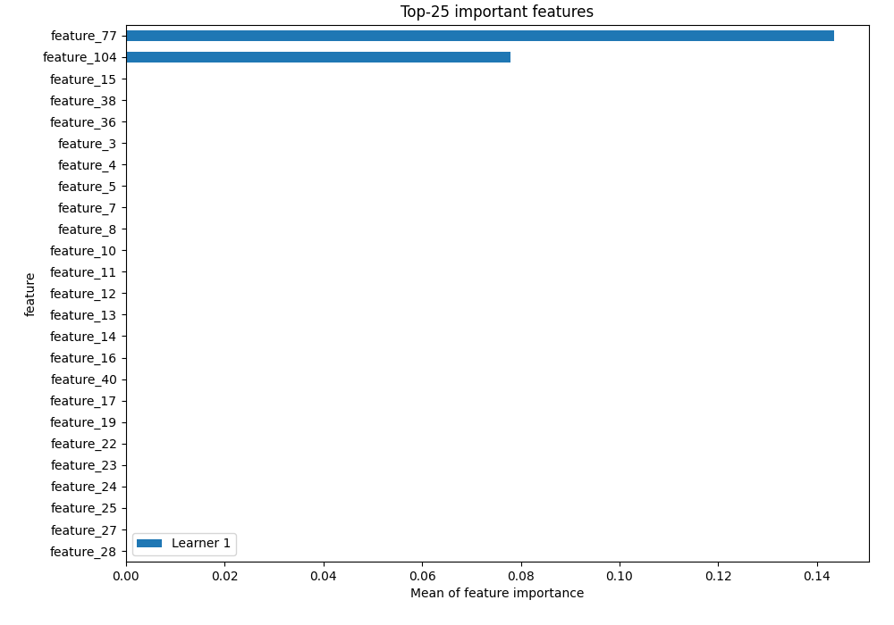
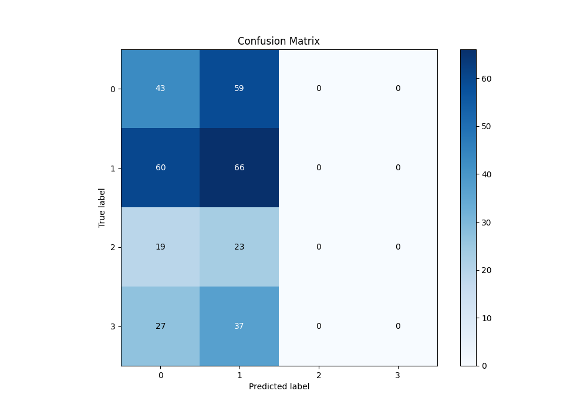
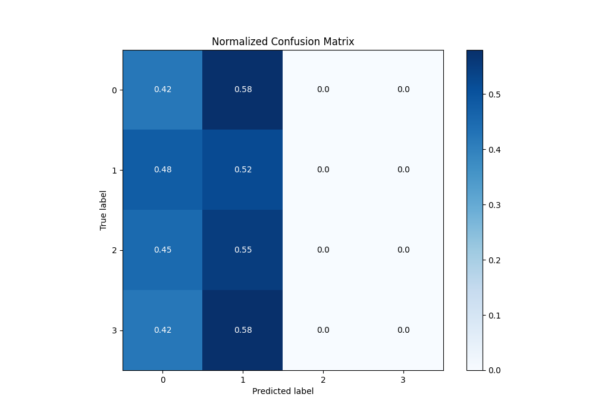
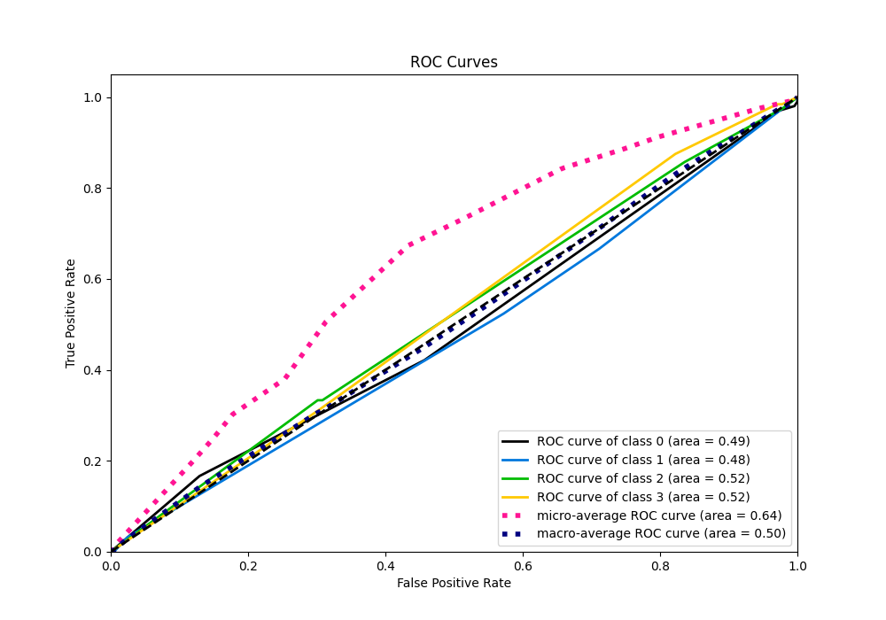
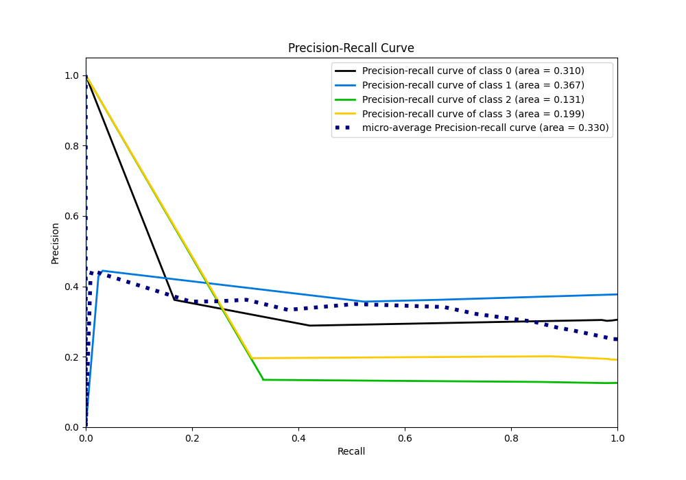

# Summary of 2_DecisionTree

[<< Go back](../README.md)

## Decision Tree
- **n_jobs**: -1
- **criterion**: gini
- **max_depth**: 3
- **num_class**: 4
- **explain_level**: 2

## Validation
 - **validation_type**: split
 - **train_ratio**: 0.75
 - **shuffle**: True
 - **stratify**: True

## Optimized metric
logloss

## Training time

4.2 seconds

### Metric details
|           |          0 |          1 |   2 |   3 |   accuracy |   macro avg |   weighted avg |   logloss |
|:----------|-----------:|-----------:|----:|----:|-----------:|------------:|---------------:|----------:|
| precision |   0.288591 |   0.356757 |   0 |   0 |   0.326347 |    0.161337 |       0.222717 |   1.44406 |
| recall    |   0.421569 |   0.52381  |   0 |   0 |   0.326347 |    0.236345 |       0.326347 |   1.44406 |
| f1-score  |   0.342629 |   0.424437 |   0 |   0 |   0.326347 |    0.191767 |       0.264752 |   1.44406 |
| support   | 102        | 126        |  42 |  64 |   0.326347 |  334        |     334        |   1.44406 |

## Confusion matrix
|              |   Predicted as 0 |   Predicted as 1 |   Predicted as 2 |   Predicted as 3 |
|:-------------|-----------------:|-----------------:|-----------------:|-----------------:|
| Labeled as 0 |               43 |               59 |                0 |                0 |
| Labeled as 1 |               60 |               66 |                0 |                0 |
| Labeled as 2 |               19 |               23 |                0 |                0 |
| Labeled as 3 |               27 |               37 |                0 |                0 |

## Learning curves

## Permutation-based Importance

## Confusion Matrix

## Normalized Confusion Matrix

## ROC Curve

## Precision Recall Curve

[<< Go back](../README.md)
