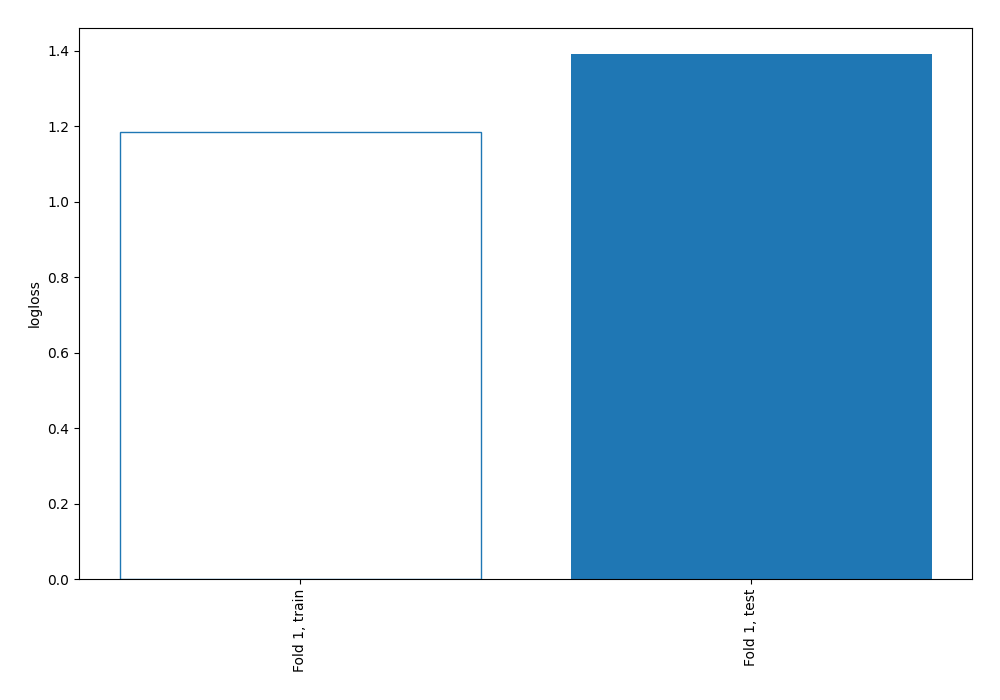
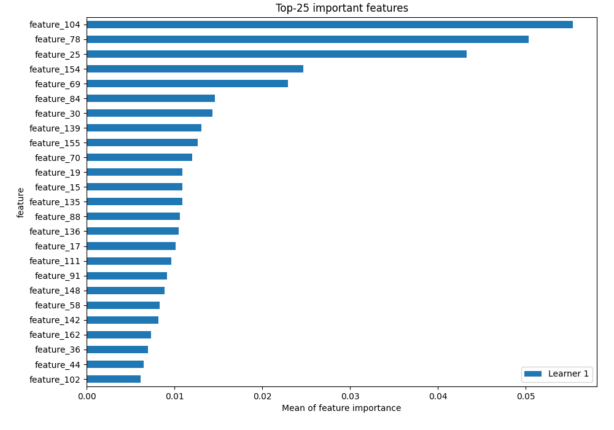
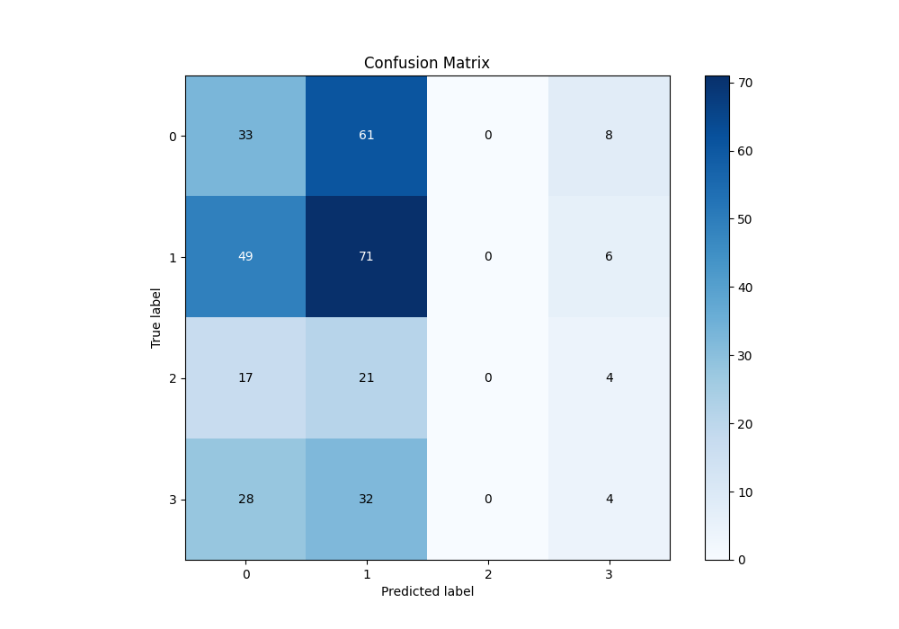
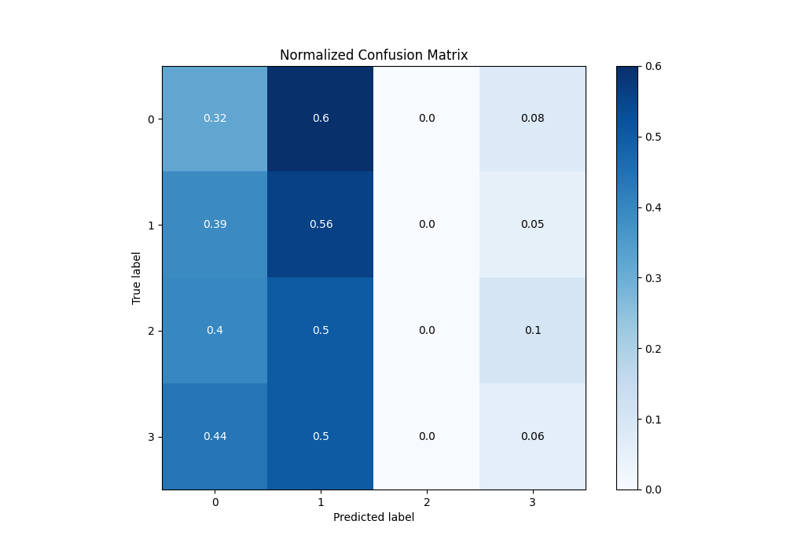
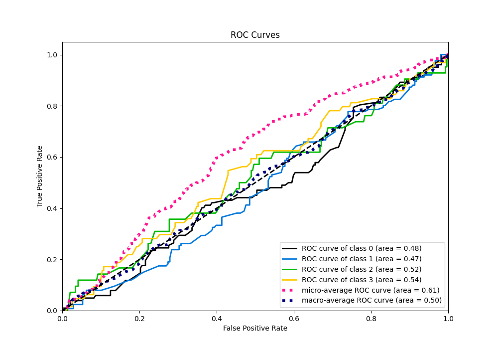
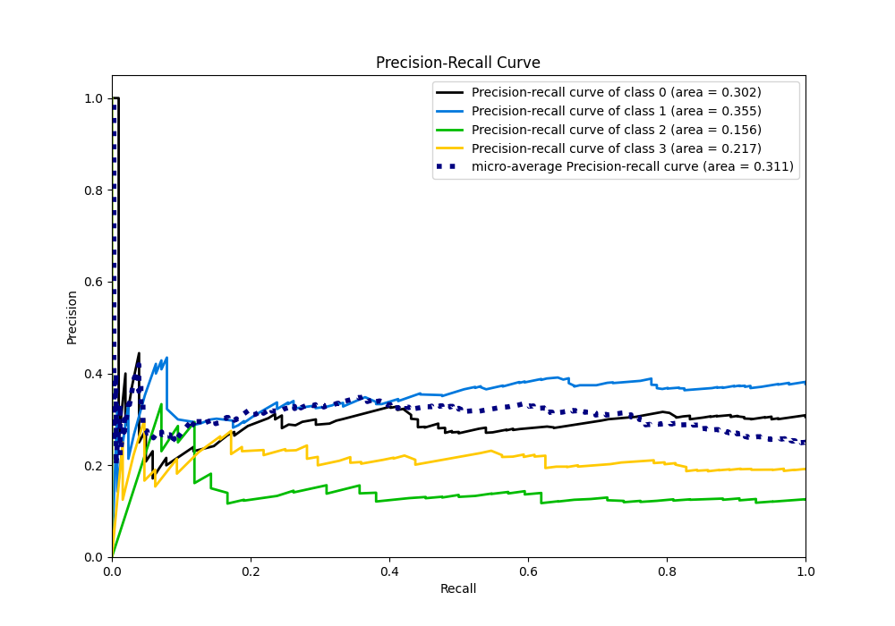

# Summary of 3_Linear

[<< Go back](../README.md)

## Logistic Regression (Linear)
- **n_jobs**: -1
- **num_class**: 4
- **explain_level**: 2

## Validation
 - **validation_type**: split
 - **train_ratio**: 0.75
 - **shuffle**: True
 - **stratify**: True

## Optimized metric
logloss

## Training time

2.3 seconds

### Metric details
|           |          0 |          1 |   2 |          3 |   accuracy |   macro avg |   weighted avg |   logloss |
|:----------|-----------:|-----------:|----:|-----------:|-----------:|------------:|---------------:|----------:|
| precision |   0.259843 |   0.383784 |   0 |  0.181818  |   0.323353 |    0.206361 |       0.258973 |   1.39094 |
| recall    |   0.323529 |   0.563492 |   0 |  0.0625    |   0.323353 |    0.23738  |       0.323353 |   1.39094 |
| f1-score  |   0.28821  |   0.456592 |   0 |  0.0930233 |   0.323353 |    0.209456 |       0.278088 |   1.39094 |
| support   | 102        | 126        |  42 | 64         |   0.323353 |  334        |     334        |   1.39094 |

## Confusion matrix
|              |   Predicted as 0 |   Predicted as 1 |   Predicted as 2 |   Predicted as 3 |
|:-------------|-----------------:|-----------------:|-----------------:|-----------------:|
| Labeled as 0 |               33 |               61 |                0 |                8 |
| Labeled as 1 |               49 |               71 |                0 |                6 |
| Labeled as 2 |               17 |               21 |                0 |                4 |
| Labeled as 3 |               28 |               32 |                0 |                4 |

## Learning curves

## Permutation-based Importance

## Confusion Matrix

## Normalized Confusion Matrix

## ROC Curve

## Precision Recall Curve

[<< Go back](../README.md)
