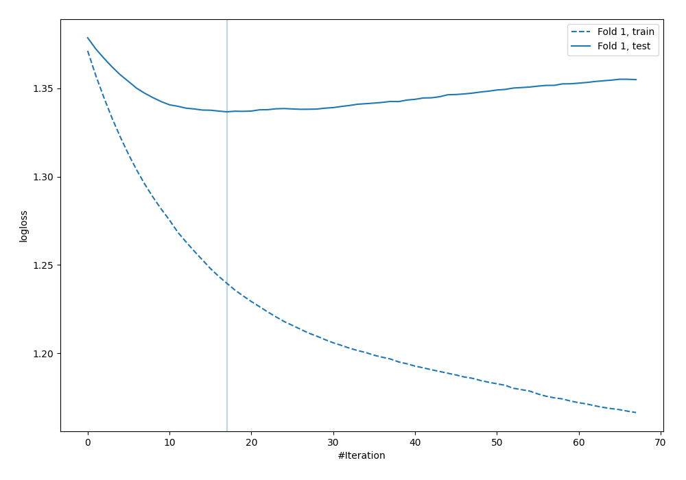
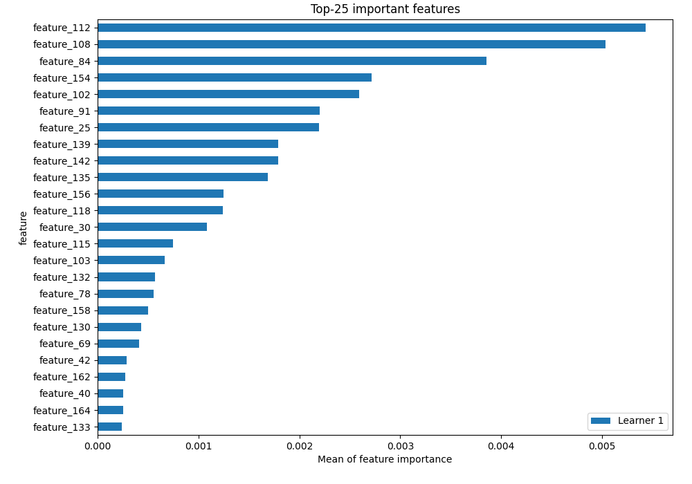
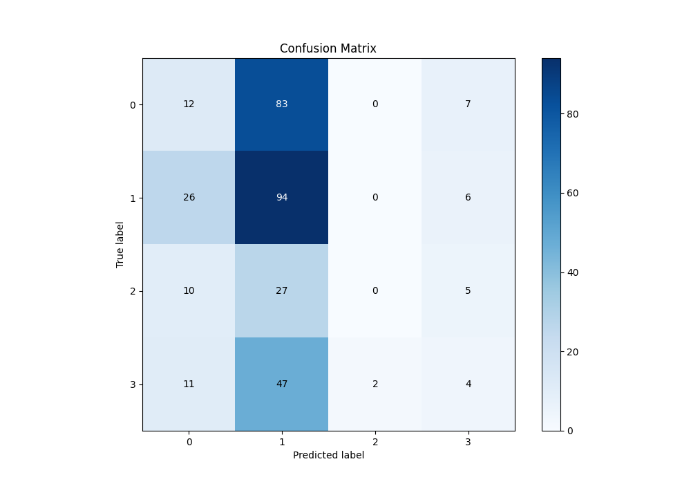
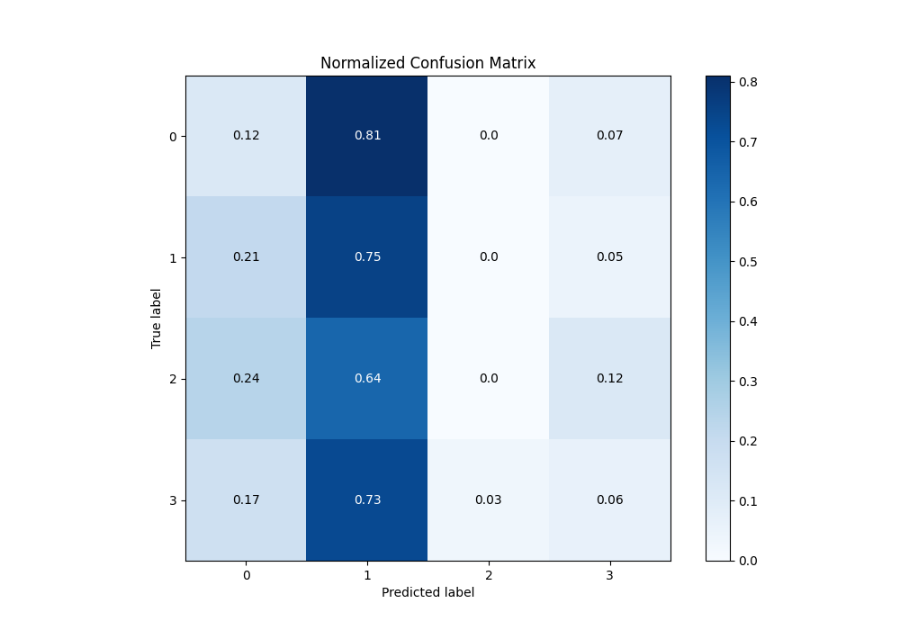
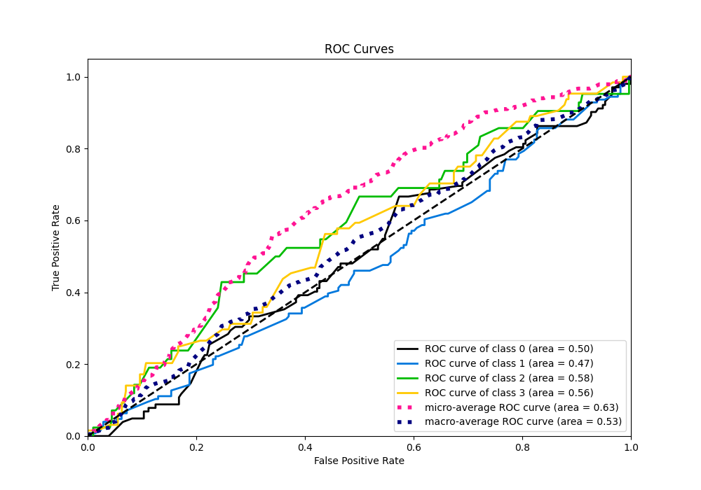
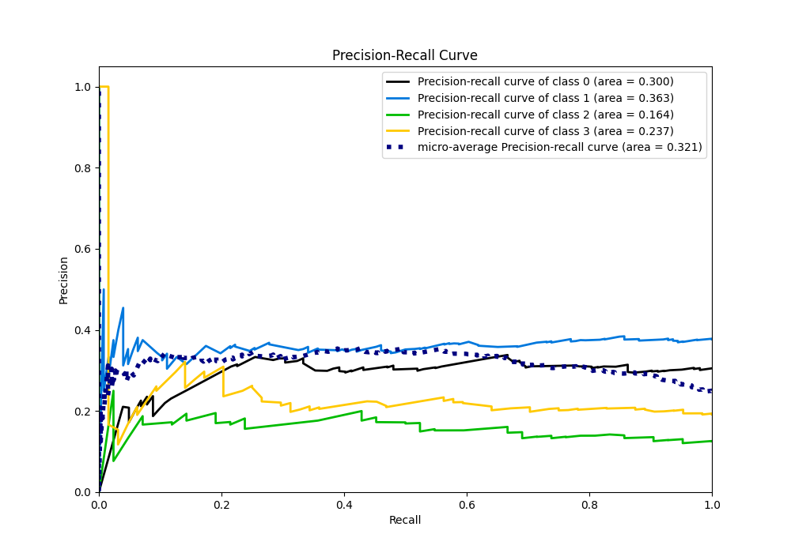

# Summary of 4_Default_Xgboost

[<< Go back](../README.md)

## Extreme Gradient Boosting (Xgboost)
- **n_jobs**: -1
- **objective**: multi:softprob
- **eta**: 0.075
- **max_depth**: 6
- **min_child_weight**: 1
- **subsample**: 1.0
- **colsample_bytree**: 1.0
- **eval_metric**: mlogloss
- **num_class**: 4
- **explain_level**: 2

## Validation
 - **validation_type**: split
 - **train_ratio**: 0.75
 - **shuffle**: True
 - **stratify**: True

## Optimized metric
logloss

## Training time

3.8 seconds

### Metric details
|           |          0 |          1 |   2 |          3 |   accuracy |   macro avg |   weighted avg |   logloss |
|:----------|-----------:|-----------:|----:|-----------:|-----------:|------------:|---------------:|----------:|
| precision |   0.20339  |   0.374502 |   0 |  0.181818  |   0.329341 |    0.189928 |       0.238232 |   1.33672 |
| recall    |   0.117647 |   0.746032 |   0 |  0.0625    |   0.329341 |    0.231545 |       0.329341 |   1.33672 |
| f1-score  |   0.149068 |   0.498674 |   0 |  0.0930233 |   0.329341 |    0.185191 |       0.251471 |   1.33672 |
| support   | 102        | 126        |  42 | 64         |   0.329341 |  334        |     334        |   1.33672 |

## Confusion matrix
|              |   Predicted as 0 |   Predicted as 1 |   Predicted as 2 |   Predicted as 3 |
|:-------------|-----------------:|-----------------:|-----------------:|-----------------:|
| Labeled as 0 |               12 |               83 |                0 |                7 |
| Labeled as 1 |               26 |               94 |                0 |                6 |
| Labeled as 2 |               10 |               27 |                0 |                5 |
| Labeled as 3 |               11 |               47 |                2 |                4 |

## Learning curves

## Permutation-based Importance

## Confusion Matrix

## Normalized Confusion Matrix

## ROC Curve

## Precision Recall Curve

[<< Go back](../README.md)
