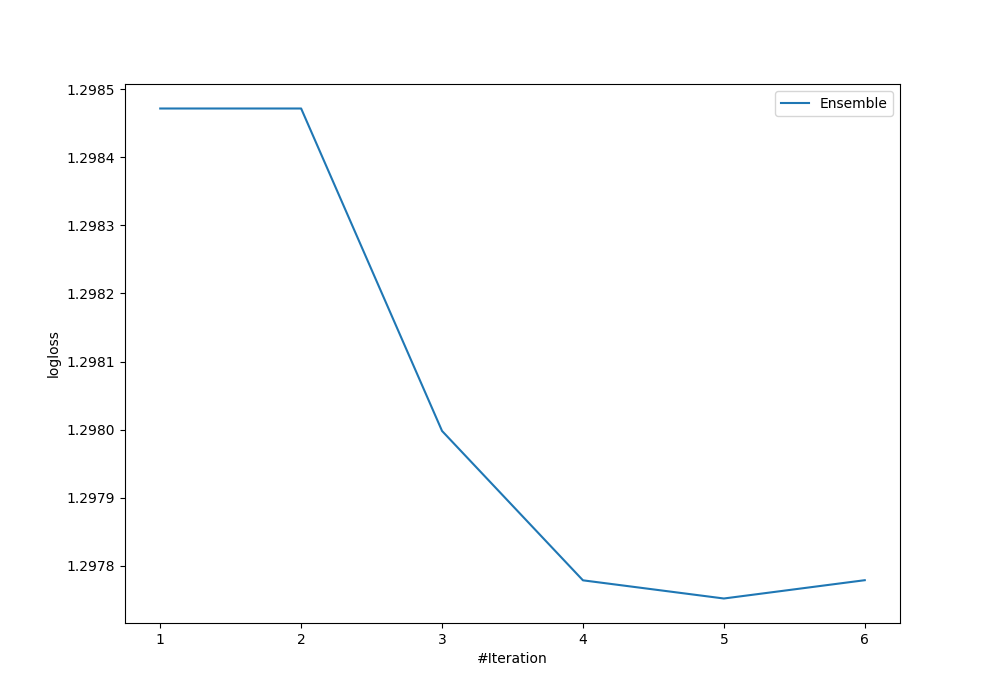
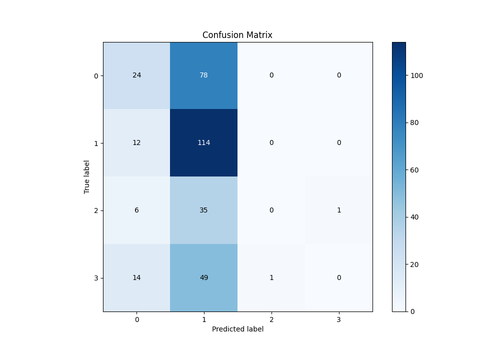
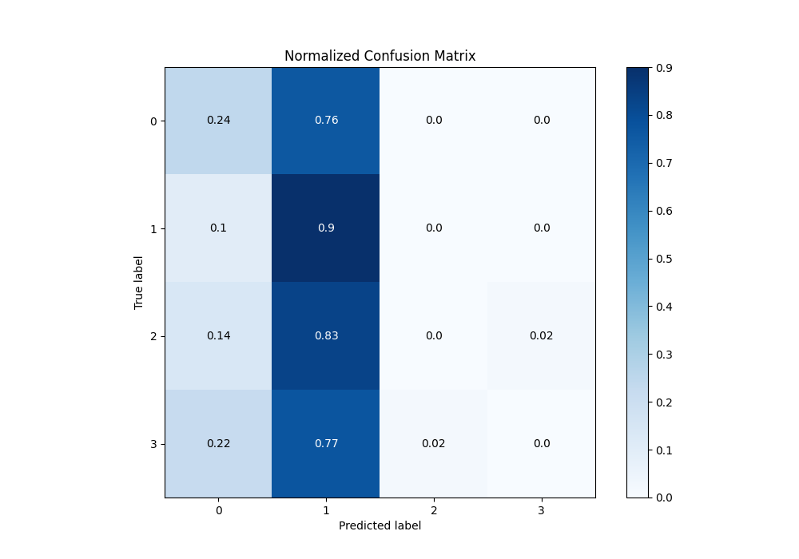
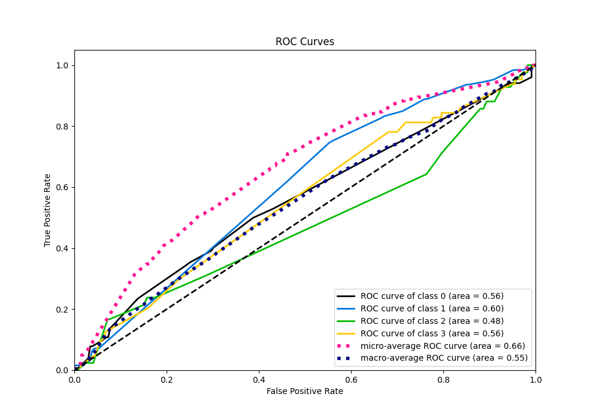
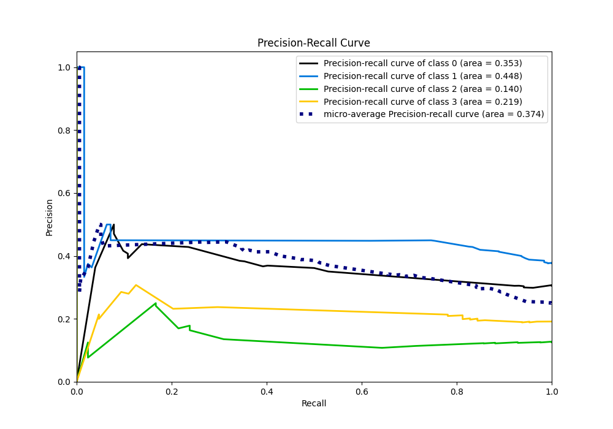

# Summary of Ensemble

[<< Go back](../README.md)

## Ensemble structure
| Model                  |   Weight |
|:-----------------------|---------:|
| 1_Baseline             |        1 |
| 6_Default_RandomForest |        4 |

### Metric details
|           |          0 |          1 |   2 |   3 |   accuracy |   macro avg |   weighted avg |   logloss |
|:----------|-----------:|-----------:|----:|----:|-----------:|------------:|---------------:|----------:|
| precision |   0.428571 |   0.413043 |   0 |   0 |   0.413174 |    0.210404 |       0.2867   |   1.29775 |
| recall    |   0.235294 |   0.904762 |   0 |   0 |   0.413174 |    0.285014 |       0.413174 |   1.29775 |
| f1-score  |   0.303797 |   0.567164 |   0 |   0 |   0.413174 |    0.21774  |       0.306737 |   1.29775 |
| support   | 102        | 126        |  42 |  64 |   0.413174 |  334        |     334        |   1.29775 |

## Confusion matrix
|              |   Predicted as 0 |   Predicted as 1 |   Predicted as 2 |   Predicted as 3 |
|:-------------|-----------------:|-----------------:|-----------------:|-----------------:|
| Labeled as 0 |               24 |               78 |                0 |                0 |
| Labeled as 1 |               12 |              114 |                0 |                0 |
| Labeled as 2 |                6 |               35 |                0 |                1 |
| Labeled as 3 |               14 |               49 |                1 |                0 |

## Learning curves

## Confusion Matrix

## Normalized Confusion Matrix

## ROC Curve

## Precision Recall Curve

[<< Go back](../README.md)
