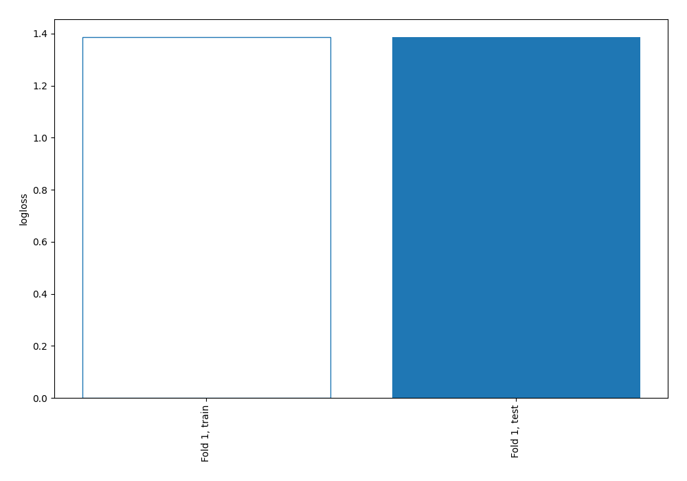
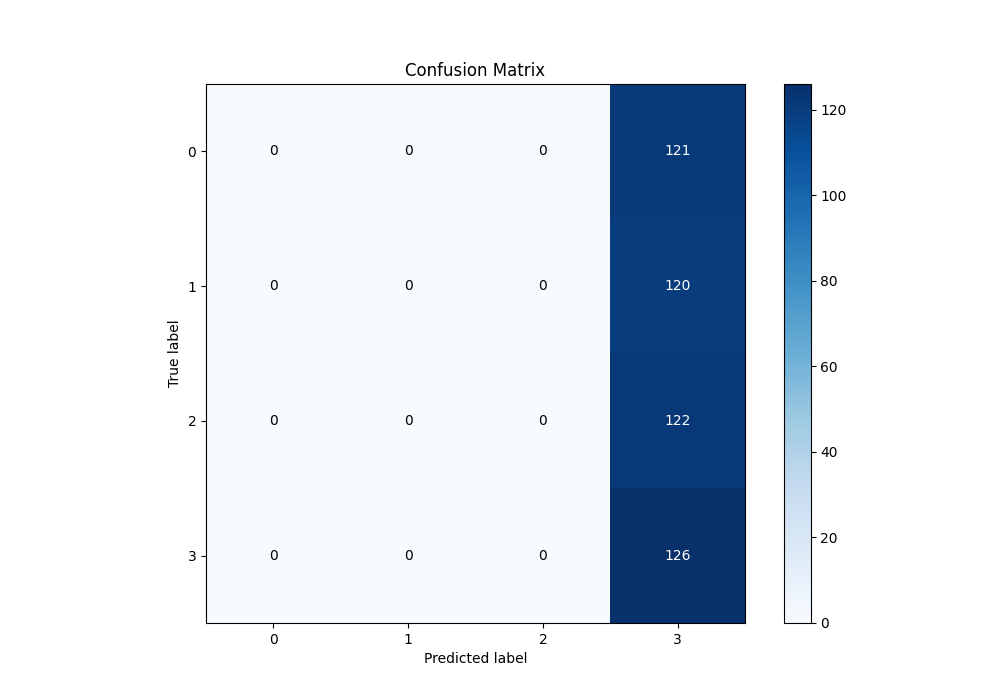
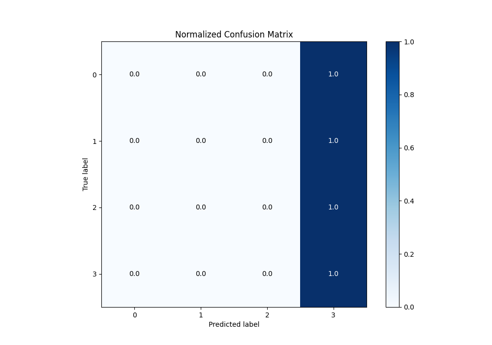
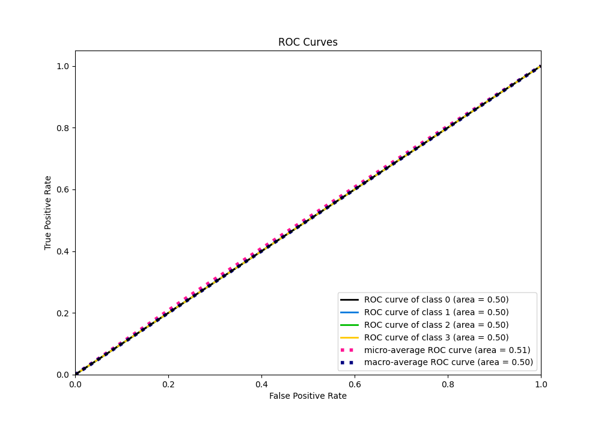
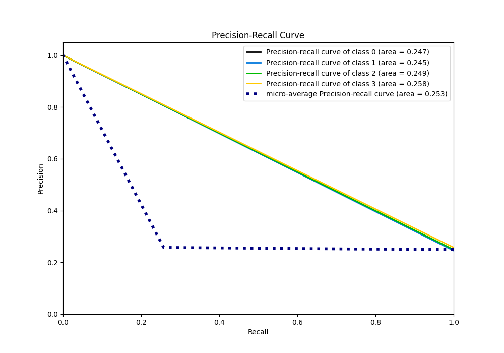

# Summary of 1_Baseline

[<< Go back](../README.md)

## Baseline Classifier (Baseline)
- **n_jobs**: -1
- **num_class**: 4
- **explain_level**: 2

## Validation
 - **validation_type**: split
 - **train_ratio**: 0.75
 - **shuffle**: True
 - **stratify**: True

## Optimized metric
logloss

## Training time

1.8 seconds

### Metric details
|           |   0 |   1 |   2 |          3 |   accuracy |   macro avg |   weighted avg |   logloss |
|:----------|----:|----:|----:|-----------:|-----------:|------------:|---------------:|----------:|
| precision |   0 |   0 |   0 |   0.257669 |   0.257669 |   0.0644172 |      0.0663932 |   1.38613 |
| recall    |   0 |   0 |   0 |   1        |   0.257669 |   0.25      |      0.257669  |   1.38613 |
| f1-score  |   0 |   0 |   0 |   0.409756 |   0.257669 |   0.102439  |      0.105581  |   1.38613 |
| support   | 121 | 120 | 122 | 126        |   0.257669 | 489         |    489         |   1.38613 |

## Confusion matrix
|              |   Predicted as 0 |   Predicted as 1 |   Predicted as 2 |   Predicted as 3 |
|:-------------|-----------------:|-----------------:|-----------------:|-----------------:|
| Labeled as 0 |                0 |                0 |                0 |              121 |
| Labeled as 1 |                0 |                0 |                0 |              120 |
| Labeled as 2 |                0 |                0 |                0 |              122 |
| Labeled as 3 |                0 |                0 |                0 |              126 |

## Learning curves

## Confusion Matrix

## Normalized Confusion Matrix

## ROC Curve

## Precision Recall Curve

[<< Go back](../README.md)
