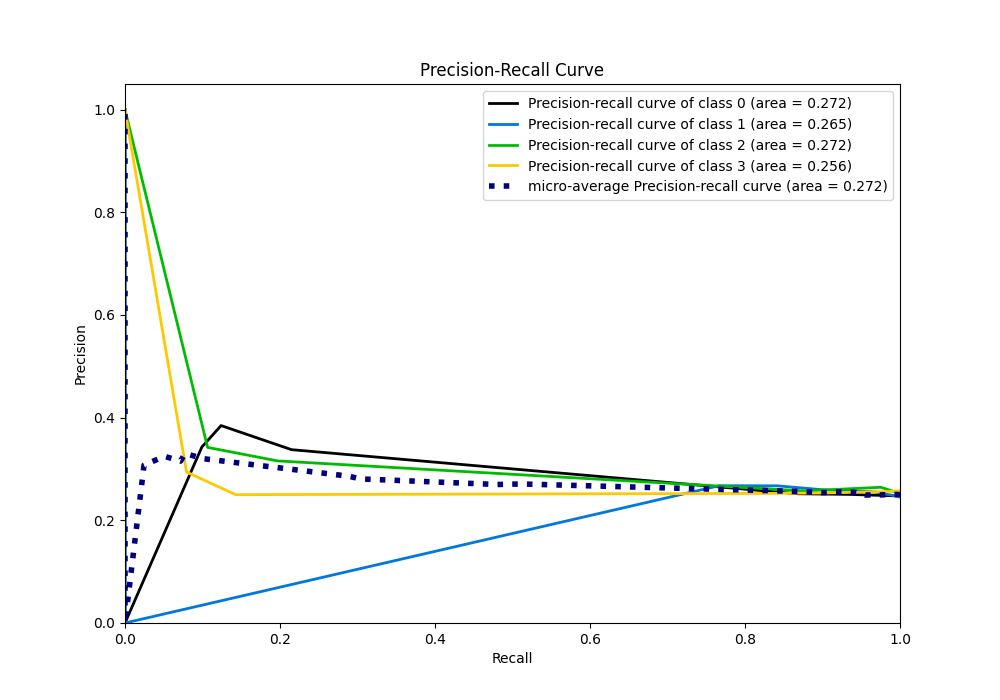

# Summary of 2_DecisionTree

[<< Go back](../README.md)

## Decision Tree
- **n_jobs**: -1
- **criterion**: gini
- **max_depth**: 3
- **num_class**: 4
- **explain_level**: 2

## Validation
 - **validation_type**: split
 - **train_ratio**: 0.75
 - **shuffle**: True
 - **stratify**: True

## Optimized metric
logloss

## Training time

28.1 seconds

### Metric details
|           |           0 |          1 |          2 |           3 |   accuracy |   macro avg |   weighted avg |   logloss |
|:----------|------------:|-----------:|-----------:|------------:|-----------:|------------:|---------------:|----------:|
| precision |   0.342857  |   0.267442 |   0.315789 |   0.294118  |   0.282209 |    0.305052 |       0.305039 |   1.44635 |
| recall    |   0.0991736 |   0.766667 |   0.196721 |   0.0793651 |   0.282209 |    0.285482 |       0.282209 |   1.44635 |
| f1-score  |   0.153846  |   0.396552 |   0.242424 |   0.125     |   0.282209 |    0.229456 |       0.228072 |   1.44635 |
| support   | 121         | 120        | 122        | 126         |   0.282209 |  489        |     489        |   1.44635 |

## Confusion matrix
|              |   Predicted as 0 |   Predicted as 1 |   Predicted as 2 |   Predicted as 3 |
|:-------------|-----------------:|-----------------:|-----------------:|-----------------:|
| Labeled as 0 |               12 |               82 |               19 |                8 |
| Labeled as 1 |                9 |               92 |               15 |                4 |
| Labeled as 2 |                3 |               83 |               24 |               12 |
| Labeled as 3 |               11 |               87 |               18 |               10 |

## Learning curves

## Permutation-based Importance

## Confusion Matrix

## Normalized Confusion Matrix

## ROC Curve

## Precision Recall Curve

[<< Go back](../README.md)
