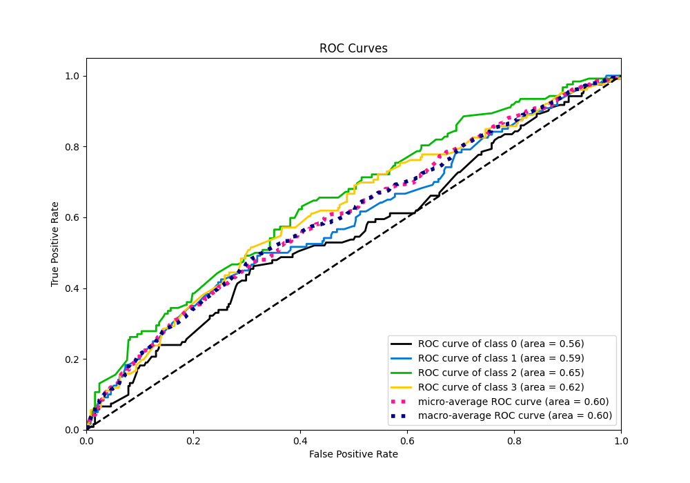

# Summary of 3_Linear

[<< Go back](../README.md)

## Logistic Regression (Linear)
- **n_jobs**: -1
- **num_class**: 4
- **explain_level**: 2

## Validation
 - **validation_type**: split
 - **train_ratio**: 0.75
 - **shuffle**: True
 - **stratify**: True

## Optimized metric
logloss

## Training time

4.6 seconds

### Metric details
|           |          0 |          1 |          2 |          3 |   accuracy |   macro avg |   weighted avg |   logloss |
|:----------|-----------:|-----------:|-----------:|-----------:|-----------:|------------:|---------------:|----------:|
| precision |   0.307692 |   0.296703 |   0.369128 |   0.348101 |   0.337423 |    0.330406 |       0.330735 |   1.36223 |
| recall    |   0.231405 |   0.225    |   0.45082  |   0.436508 |   0.337423 |    0.335933 |       0.337423 |   1.36223 |
| f1-score  |   0.264151 |   0.255924 |   0.405904 |   0.387324 |   0.337423 |    0.328326 |       0.329236 |   1.36223 |
| support   | 121        | 120        | 122        | 126        |   0.337423 |  489        |     489        |   1.36223 |

## Confusion matrix
|              |   Predicted as 0 |   Predicted as 1 |   Predicted as 2 |   Predicted as 3 |
|:-------------|-----------------:|-----------------:|-----------------:|-----------------:|
| Labeled as 0 |               28 |               31 |               29 |               33 |
| Labeled as 1 |               21 |               27 |               30 |               42 |
| Labeled as 2 |               18 |               21 |               55 |               28 |
| Labeled as 3 |               24 |               12 |               35 |               55 |

## Learning curves

## Permutation-based Importance

## Confusion Matrix

## Normalized Confusion Matrix

## ROC Curve

## Precision Recall Curve

[<< Go back](../README.md)
