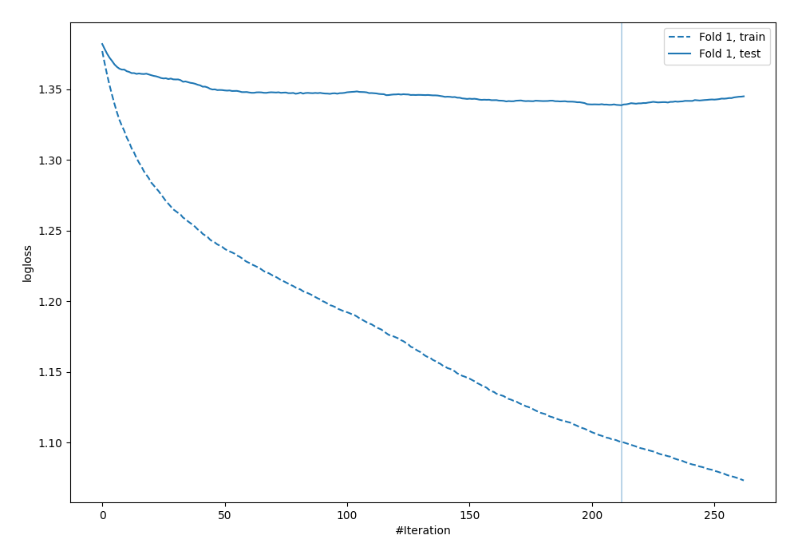
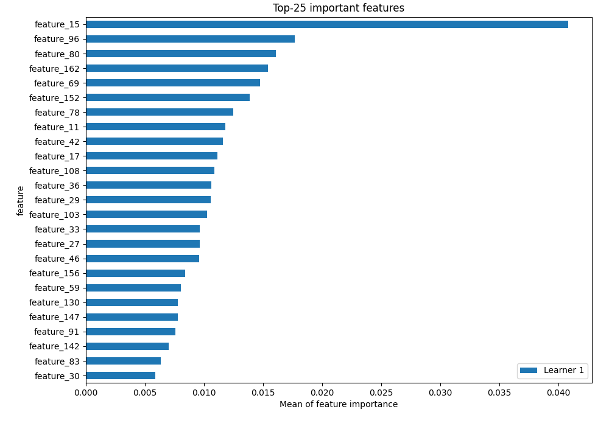
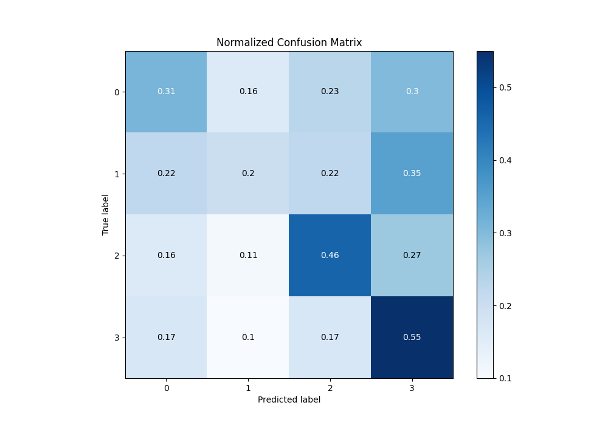
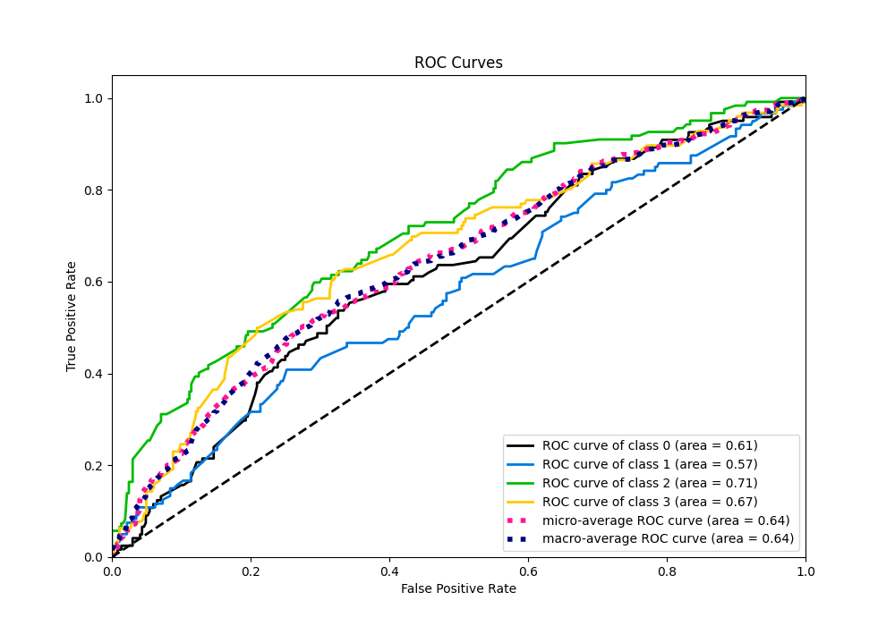
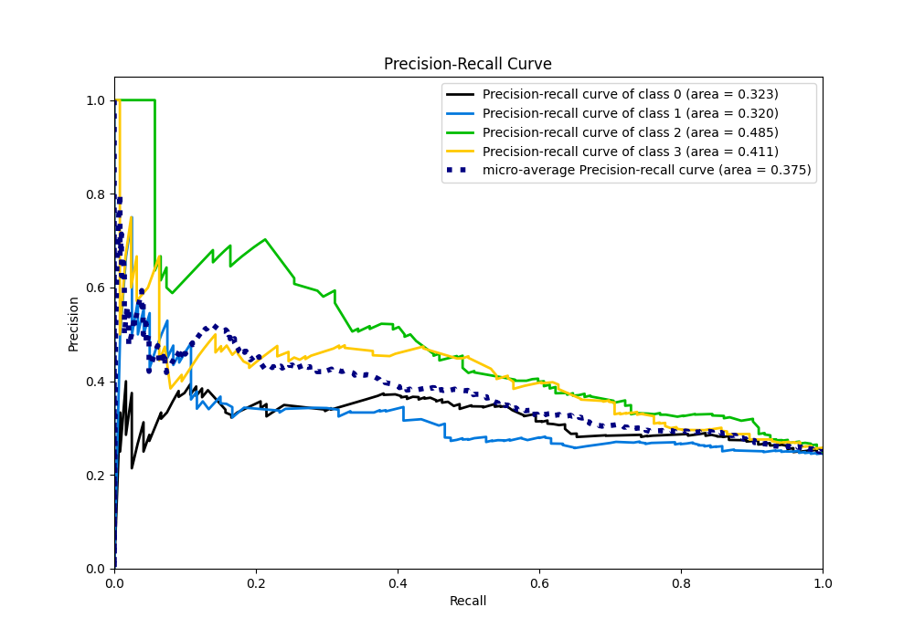

# Summary of 4_Default_Xgboost

[<< Go back](../README.md)

## Extreme Gradient Boosting (Xgboost)
- **n_jobs**: -1
- **objective**: multi:softprob
- **eta**: 0.075
- **max_depth**: 6
- **min_child_weight**: 1
- **subsample**: 1.0
- **colsample_bytree**: 1.0
- **eval_metric**: mlogloss
- **num_class**: 4
- **explain_level**: 2

## Validation
 - **validation_type**: split
 - **train_ratio**: 0.75
 - **shuffle**: True
 - **stratify**: True

## Optimized metric
logloss

## Training time

17.7 seconds

### Metric details
|           |          0 |          1 |          2 |          3 |   accuracy |   macro avg |   weighted avg |   logloss |
|:----------|-----------:|-----------:|-----------:|-----------:|-----------:|------------:|---------------:|----------:|
| precision |   0.35514  |   0.347826 |   0.421053 |   0.383333 |   0.382413 |    0.376838 |       0.377054 |   1.33863 |
| recall    |   0.31405  |   0.2      |   0.459016 |   0.547619 |   0.382413 |    0.380171 |       0.382413 |   1.33863 |
| f1-score  |   0.333333 |   0.253968 |   0.439216 |   0.45098  |   0.382413 |    0.369374 |       0.370588 |   1.33863 |
| support   | 121        | 120        | 122        | 126        |   0.382413 |  489        |     489        |   1.33863 |

## Confusion matrix
|              |   Predicted as 0 |   Predicted as 1 |   Predicted as 2 |   Predicted as 3 |
|:-------------|-----------------:|-----------------:|-----------------:|-----------------:|
| Labeled as 0 |               38 |               19 |               28 |               36 |
| Labeled as 1 |               27 |               24 |               27 |               42 |
| Labeled as 2 |               20 |               13 |               56 |               33 |
| Labeled as 3 |               22 |               13 |               22 |               69 |

## Learning curves

## Permutation-based Importance

## Confusion Matrix

## Normalized Confusion Matrix

## ROC Curve

## Precision Recall Curve

[<< Go back](../README.md)
