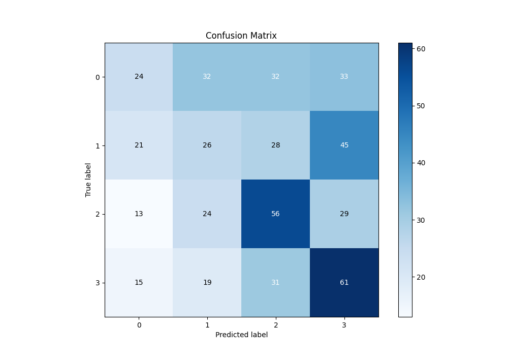

# Summary of 5_Default_NeuralNetwork

[<< Go back](../README.md)

## Neural Network
- **n_jobs**: -1
- **dense_1_size**: 32
- **dense_2_size**: 16
- **learning_rate**: 0.05
- **num_class**: 4
- **explain_level**: 2

## Validation
 - **validation_type**: split
 - **train_ratio**: 0.75
 - **shuffle**: True
 - **stratify**: True

## Optimized metric
logloss

## Training time

4.3 seconds

### Metric details
|           |          0 |          1 |          2 |          3 |   accuracy |   macro avg |   weighted avg |   logloss |
|:----------|-----------:|-----------:|-----------:|-----------:|-----------:|------------:|---------------:|----------:|
| precision |   0.328767 |   0.257426 |   0.380952 |   0.363095 |   0.341513 |    0.33256  |       0.333125 |   1.73585 |
| recall    |   0.198347 |   0.216667 |   0.459016 |   0.484127 |   0.341513 |    0.339539 |       0.341513 |   1.73585 |
| f1-score  |   0.247423 |   0.235294 |   0.416357 |   0.414966 |   0.341513 |    0.32851  |       0.329764 |   1.73585 |
| support   | 121        | 120        | 122        | 126        |   0.341513 |  489        |     489        |   1.73585 |

## Confusion matrix
|              |   Predicted as 0 |   Predicted as 1 |   Predicted as 2 |   Predicted as 3 |
|:-------------|-----------------:|-----------------:|-----------------:|-----------------:|
| Labeled as 0 |               24 |               32 |               32 |               33 |
| Labeled as 1 |               21 |               26 |               28 |               45 |
| Labeled as 2 |               13 |               24 |               56 |               29 |
| Labeled as 3 |               15 |               19 |               31 |               61 |

## Learning curves

## Permutation-based Importance

## Confusion Matrix

## Normalized Confusion Matrix

## ROC Curve

## Precision Recall Curve

[<< Go back](../README.md)
