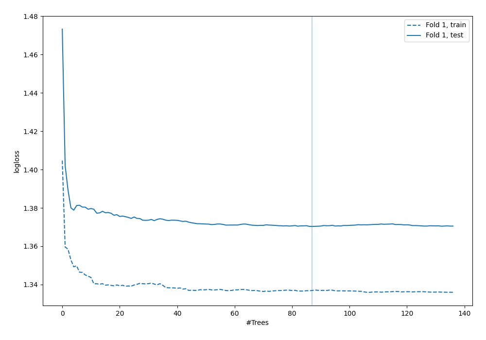
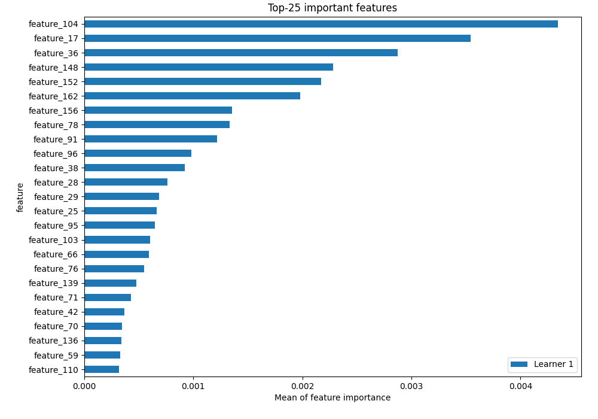
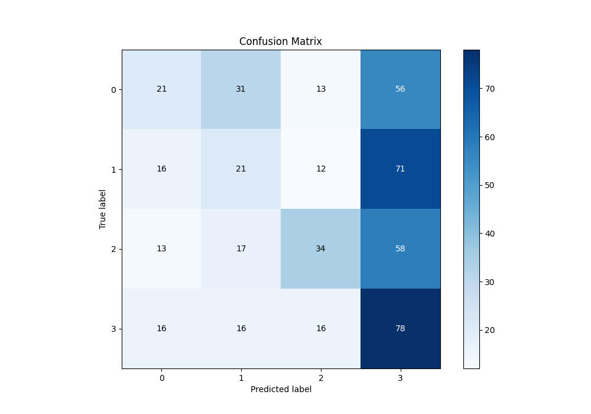
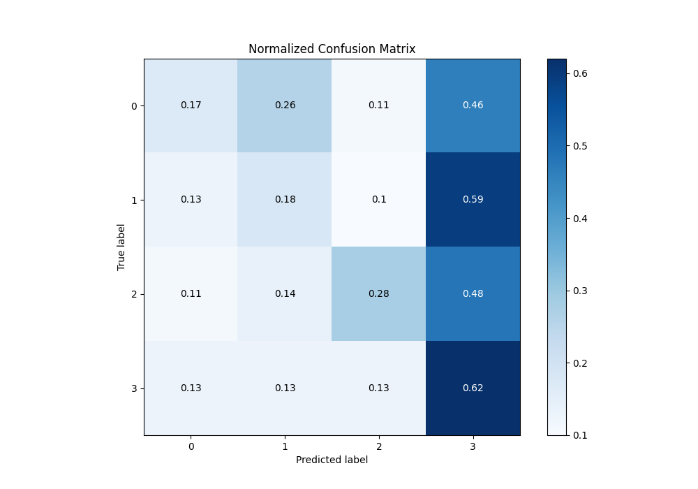
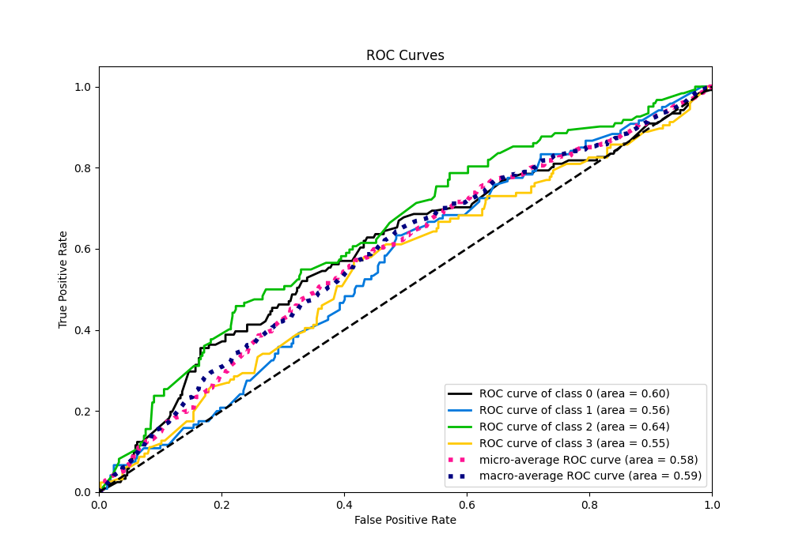
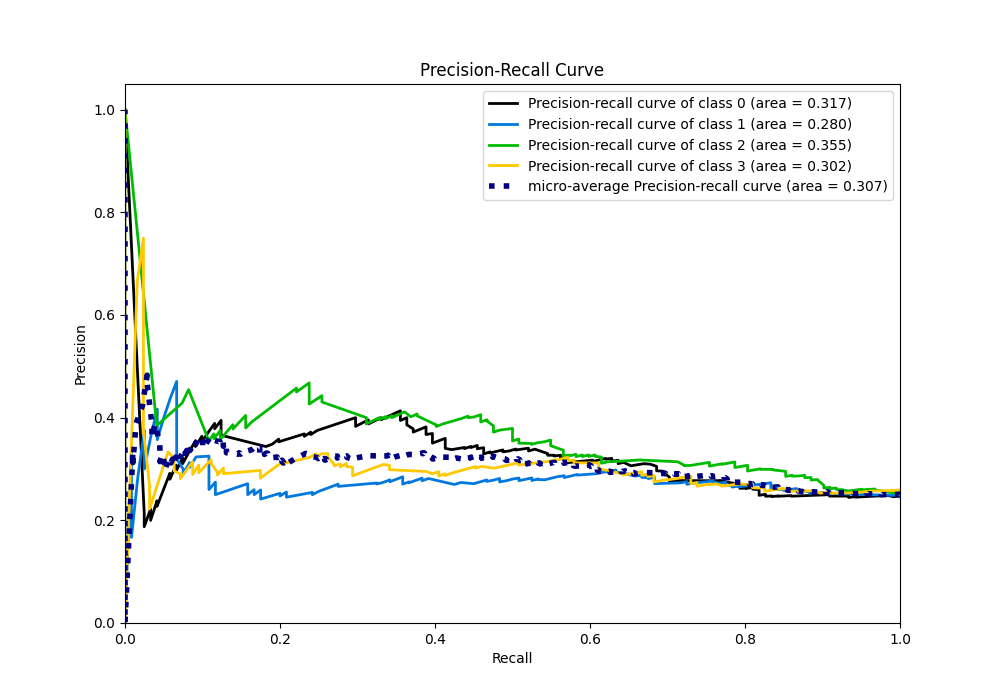

# Summary of 6_Default_RandomForest

[<< Go back](../README.md)

## Random Forest
- **n_jobs**: -1
- **criterion**: gini
- **max_features**: 0.9
- **min_samples_split**: 30
- **max_depth**: 4
- **eval_metric_name**: logloss
- **num_class**: 4
- **explain_level**: 2

## Validation
 - **validation_type**: split
 - **train_ratio**: 0.75
 - **shuffle**: True
 - **stratify**: True

## Optimized metric
logloss

## Training time

17.0 seconds

### Metric details
|           |          0 |          1 |          2 |          3 |   accuracy |   macro avg |   weighted avg |   logloss |
|:----------|-----------:|-----------:|-----------:|-----------:|-----------:|------------:|---------------:|----------:|
| precision |   0.318182 |   0.247059 |   0.453333 |   0.296578 |   0.314928 |    0.328788 |       0.32888  |   1.37034 |
| recall    |   0.173554 |   0.175    |   0.278689 |   0.619048 |   0.314928 |    0.311572 |       0.314928 |   1.37034 |
| f1-score  |   0.224599 |   0.204878 |   0.345178 |   0.401028 |   0.314928 |    0.293921 |       0.295303 |   1.37034 |
| support   | 121        | 120        | 122        | 126        |   0.314928 |  489        |     489        |   1.37034 |

## Confusion matrix
|              |   Predicted as 0 |   Predicted as 1 |   Predicted as 2 |   Predicted as 3 |
|:-------------|-----------------:|-----------------:|-----------------:|-----------------:|
| Labeled as 0 |               21 |               31 |               13 |               56 |
| Labeled as 1 |               16 |               21 |               12 |               71 |
| Labeled as 2 |               13 |               17 |               34 |               58 |
| Labeled as 3 |               16 |               16 |               16 |               78 |

## Learning curves

## Permutation-based Importance

## Confusion Matrix

## Normalized Confusion Matrix

## ROC Curve

## Precision Recall Curve

[<< Go back](../README.md)
