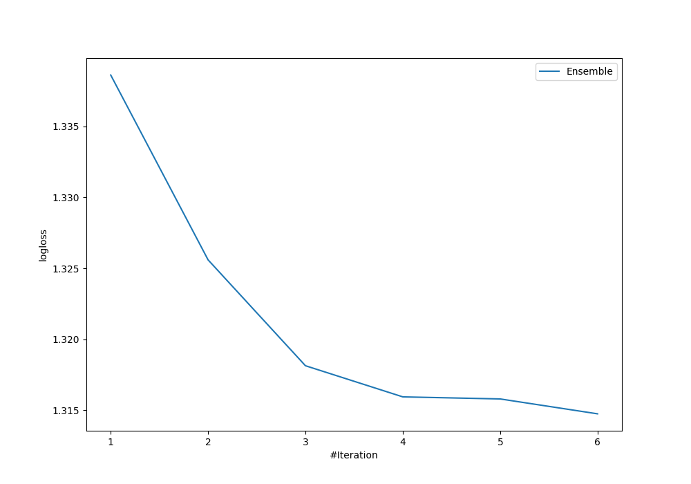
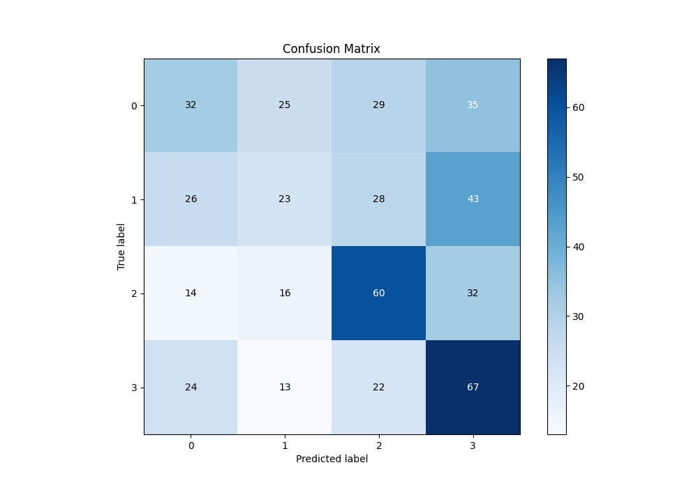
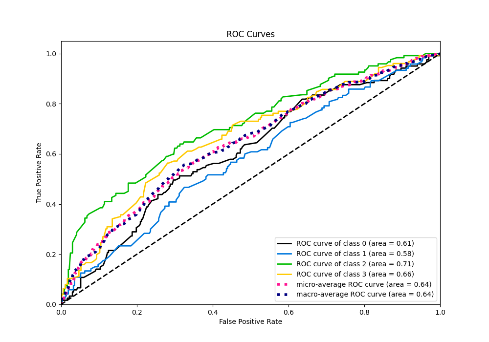
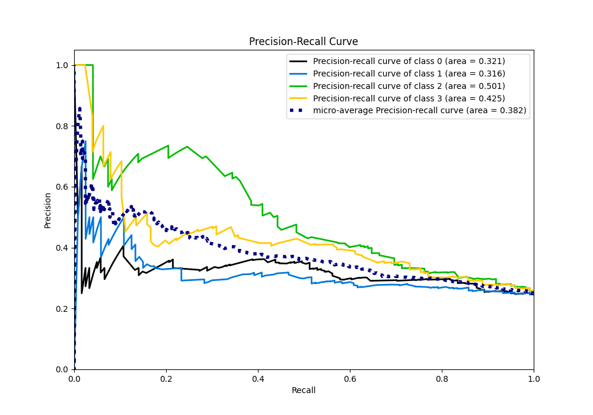

# Summary of Ensemble

[<< Go back](../README.md)

## Ensemble structure
| Model                   |   Weight |
|:------------------------|---------:|
| 1_Baseline              |        2 |
| 4_Default_Xgboost       |        3 |
| 5_Default_NeuralNetwork |        1 |

### Metric details
|           |          0 |          1 |          2 |          3 |   accuracy |   macro avg |   weighted avg |   logloss |
|:----------|-----------:|-----------:|-----------:|-----------:|-----------:|------------:|---------------:|----------:|
| precision |   0.333333 |   0.298701 |   0.431655 |   0.378531 |   0.372188 |    0.360555 |       0.361011 |   1.31473 |
| recall    |   0.264463 |   0.191667 |   0.491803 |   0.531746 |   0.372188 |    0.36992  |       0.372188 |   1.31473 |
| f1-score  |   0.294931 |   0.233503 |   0.45977  |   0.442244 |   0.372188 |    0.357612 |       0.35894  |   1.31473 |
| support   | 121        | 120        | 122        | 126        |   0.372188 |  489        |     489        |   1.31473 |

## Confusion matrix
|              |   Predicted as 0 |   Predicted as 1 |   Predicted as 2 |   Predicted as 3 |
|:-------------|-----------------:|-----------------:|-----------------:|-----------------:|
| Labeled as 0 |               32 |               25 |               29 |               35 |
| Labeled as 1 |               26 |               23 |               28 |               43 |
| Labeled as 2 |               14 |               16 |               60 |               32 |
| Labeled as 3 |               24 |               13 |               22 |               67 |

## Learning curves

## Confusion Matrix

## Normalized Confusion Matrix

## ROC Curve

## Precision Recall Curve

[<< Go back](../README.md)
